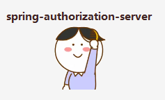

# spring-authorization-server | 入门到包会

  
  
  
  

1. spring-authorization-server 入门
- [😄Spring Authorization Server (1) oauth2.1、oidc 1.0 概念初步认识和基于maven的demo源码](https://github.com/WatermelonPlanet/spring-authorization-server-demo/blob/master/doc/oauth2/introduction/oauth_1.md)
- [😄Spring Authorization Server (2)【授权服务、资源服务、客户端服务】初步认识](https://github.com/WatermelonPlanet/spring-authorization-server-demo/blob/master/doc/oauth2/introduction/oauth_2.md)
- [😄Spring Authorization Server (3) 集成第三方gitee、github登录](https://github.com/WatermelonPlanet/spring-authorization-server-demo/blob/master/doc/oauth2/introduction/oauth_3.md)
- [😄Spring Authorization Server (4) 客户端、授权服务器认证授权流程的深入解析](https://github.com/WatermelonPlanet/spring-authorization-server-demo/blob/master/doc/oauth2/introduction/oauth_4.md)

2. spring-authorization-server 进阶
- [😄Spring Authorization Server (5) RegisteredClientRepository、UserDetailsService、UserDetails扩展](https://github.com/WatermelonPlanet/spring-authorization-server-demo/blob/master/doc/oauth2/progress/oauth_5.md)
- [😄Spring Authorization Server (6) 授权类型扩展-手机号+短信登录](https://github.com/WatermelonPlanet/spring-authorization-server-demo/blob/master/doc/oauth2/progress/oauth_6.md)
- [# 😄Spring Authorization Server (7) 第三方平台账号存储](https://github.com/WatermelonPlanet/spring-authorization-server-demo/blob/master/doc/oauth2/progress/oauth_7.md)

更新中...