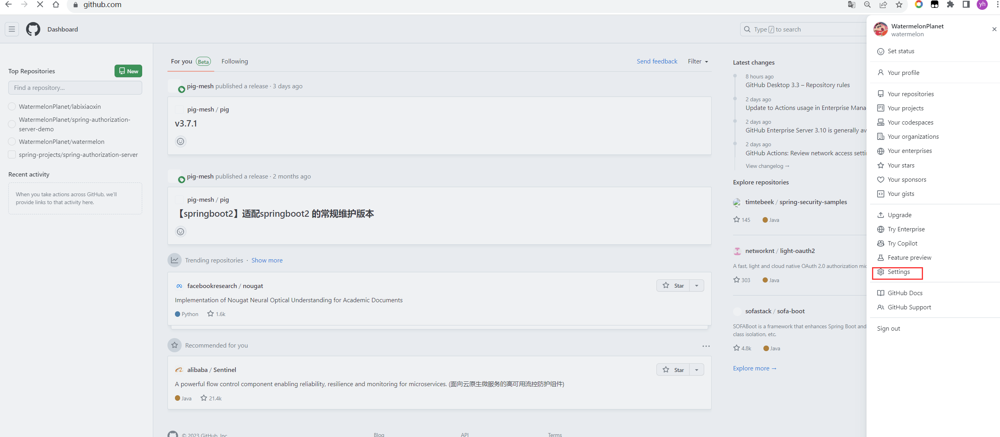
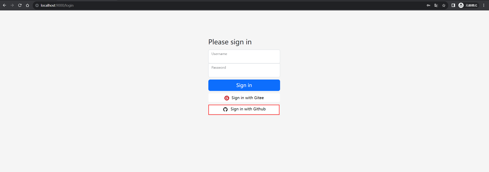
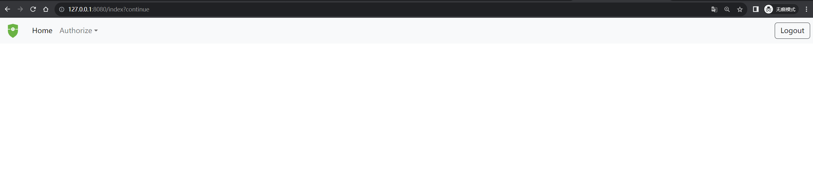
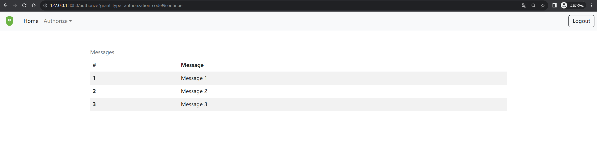
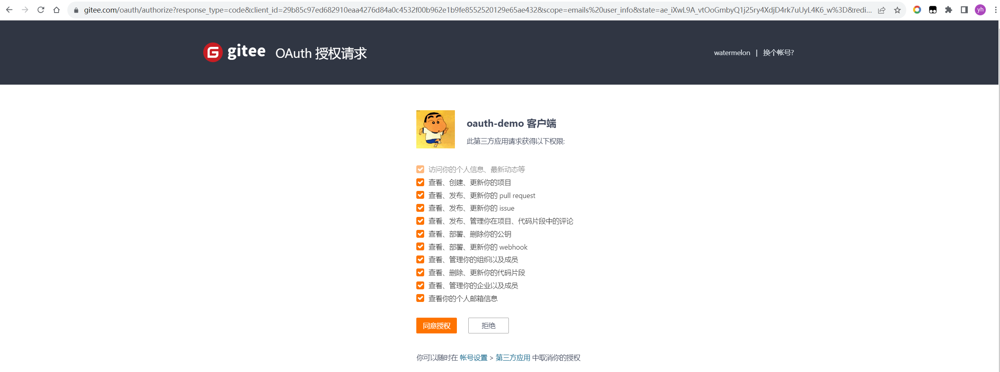

## 😄Spring Authorization Server (3) 集成第三方【gitee、github】登录


`建议集成gitee即可，github的网络请求不太稳定，梯子可能也会出现不稳定的情况`


#### [github集成](https://github.com/settings/developers)

**1. 在github中创建一个oauth应用**

- 步骤如下
  
  
  
  
  
- [`github oauth 文档链接：https://docs.github.com/en/apps/oauth-apps/building-oauth-apps/authorizing-oauth-apps`](https://docs.github.com/en/apps/oauth-apps/building-oauth-apps/authorizing-oauth-apps)

**2. demo-authorizationserver 的授权服务器配置**

- 添加oauth配置

  ````yaml
  spring:
    security:
      oauth2:
        client:
          registration:
            github: # 这个唯一就可以了 对应的也就是 {registrationId}
              provider: github # 换个对应如下的 provider
              client-id: 2205af0f0cc93e3a22ea #刚刚创建应用的client-id
              client-secret: 649d88df840a57d2591c4832b438cc9af2727240 #刚刚创建应用的client-secret
              redirect-uri: http://localhost:9000/login/oauth2/code/github # 模板 `{baseUrl}/login/oauth2/code/{registrationId}`
              scope: user:email, read:user #这个可以参考文档根据需要修改
              client-name: Sign in with GitHub

          provider:
            github:
              user-name-attribute: login
  ````
**3. demo 示例**

  - 我们现在访问客户端的主页：127.0.0.1:8080/index时，浏览器会重定向到：http://localhost:9000/login
    
    
  - 使用github登录
    
    
    
  - 我们自己的授权服务进行授权
    
  - 客户端成功访问
    
  - 客户端成功访问资源服务
    


#### [gitee集成](https://gitee.com/oauth/applications)

**1. 在gitee中创建一个第三方应用**

- 步骤如下
  - 找到gitee创建第三方应用的这个位置
  
  - 创建应用 
  
  
  
**2. demo-authorizationserver 的授权服务器配置**
  ````yaml
  spring:
    security:
      oauth2:
        client:
          registration:
            gitee:
              # 指定oauth登录提供者，该oauth登录由provider中的gitee来处理
              provider: gitee
              # 客户端名字
              client-name: Sign in with Gitee
              # 认证方式
              authorization-grant-type: authorization_code
              # 客户端id，使用自己的gitee的客户端id
              client-id: 29b85c97ed682910eaa4276d84a0c4532f00b962e1b9fe8552520129e65ae432
              # 客户端秘钥，使用自己的gitee的客户端秘钥
              client-secret: 8c6df920482a83d4662a34b76a9c3a62c8e80713e4f2957bb0459c3ceb70d73b
              # 回调地址 与gitee 配置的回调地址一致才行
              redirect-uri: http://192.168.56.1:9000/login/oauth2/code/gitee
              # 申请scope列表
              scope:
                - emails
                - user_info

          provider:
            gitee:
            # 设置用户信息名称对应的字段属性
            user-name-attribute: login
            # 获取token的地址
            token-uri: https://gitee.com/oauth/token
            # 获取用户信息的地址
            user-info-uri: https://gitee.com/api/v5/user
            # 发起授权申请的地址
            authorization-uri: https://gitee.com/oauth/authorize
  ````


**3. demo示例** 

- 我们现在访问客户端的主页：127.0.0.1:8080/index时，浏览器会重定向到：http://192.168.56.1:9000/login（因为demo-client中的配置我们修改为http://192.168.56.1:9000了）
    
- 因为刚刚已经登录过gitee了，所以这个地方直接到授权页了 
  
- gitee授权完成后（授权后就会回调到我们本地服务，然后跳转到授权页）
  
- 客户端成功访问资源服务
  


#### 总结

1. `http://192.168.56.1:9000/login/oauth2/code/github`，是spring-security-oauth2-client提供的一个模板 URL  [`{baseUrl}/login/oauth2/code/{registrationId}`](https://docs.spring.io/spring-security/reference/6.1-SNAPSHOT/reactive/oauth2/login/core.html) ，
 第三方应用配置的回调调用 对应`OAuth2LoginAuthenticationFilter` 做后续处理， 在spring-security的源码中通过`login/oauth2/code`能搜索到 `OAuth2LoginAuthenticationFilter`。
   
   ````java
   public class OAuth2LoginAuthenticationFilter extends AbstractAuthenticationProcessingFilter {

              //The default URI where this Filter processes authentication requests.
              public static final String DEFAULT_FILTER_PROCESSES_URI = "/login/oauth2/code/*";
               ...
              @Override
              public Authentication attemptAuthentication(HttpServletRequest request, HttpServletResponse response)
                      throws AuthenticationException {
                  ...
              }
   
   }
   ```` 
2. 第三方回调地址 一定要与授权服务器（demo-authorizationserver）的yml中的回调地址一致，否则出现异常。
3. demo-client的 `spring.security.oauth2.client.provider.issuer-uri` 配置一定不要与 demo-authorizationserver服务在同一个域下，例如当前demo-client 是 http://127.0.0.1:8080，那么 `spring.security.oauth2.client.provider.issuer-uri` 配http://192.168.56.1:9000，就不要配置 http://127.0.0.1:9000 后面详细讲讲这个的原因


