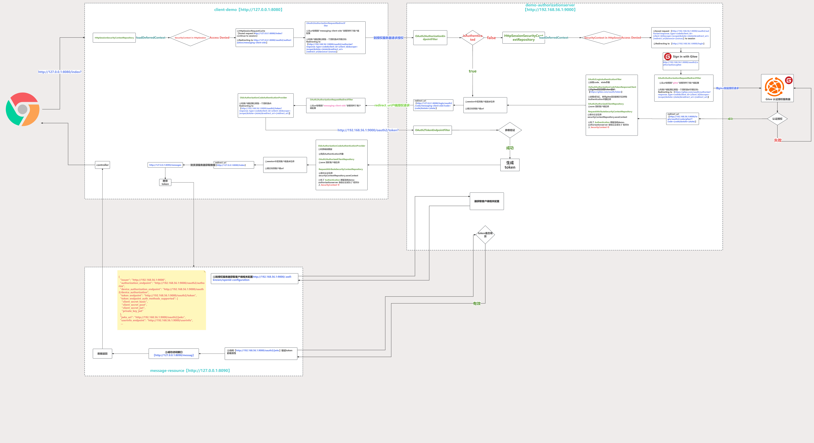

## 😄Spring Authorization Server (4) 客户端、授权服务器认证授权流程的深入解析

#### demo-client（客户端）

**从提供的demo中可以理解为 demo-client就是客户端，或者也理解为：引入了 `spring-boot-starter-oauth2-client`依赖的也是客户端**

demo-client中、demo-authorizationserver中都引入 `spring-boot-starter-oauth2-client`依赖，他们的作用肯定也是一致，我们来一起看看

访问 `http://127.0.0.1:8080/index`，看看`demo-client`的日志，进行解析。

````java
2023-09-04T16:34:56.211+08:00 DEBUG 6224 --- [  XNIO-1 task-2] o.s.security.web.FilterChainProxy        : Securing GET /index
2023-09-04T16:34:56.212+08:00 DEBUG 6224 --- [  XNIO-1 task-2] o.s.s.w.a.AnonymousAuthenticationFilter  : Set SecurityContextHolder to anonymous SecurityContext
2023-09-04T16:34:56.213+08:00 DEBUG 6224 --- [  XNIO-1 task-2] o.s.s.w.s.HttpSessionRequestCache        : Saved request http://127.0.0.1:8080/index?continue to session
2023-09-04T16:34:56.214+08:00 DEBUG 6224 --- [  XNIO-1 task-2] o.s.s.web.DefaultRedirectStrategy        : Redirecting to http://127.0.0.1:8080/oauth2/authorization/messaging-client-oidc
2023-09-04T16:34:56.225+08:00 DEBUG 6224 --- [  XNIO-1 task-2] o.s.security.web.FilterChainProxy        : Securing GET /oauth2/authorization/messaging-client-oidc
2023-09-04T16:34:56.226+08:00 DEBUG 6224 --- [  XNIO-1 task-2] o.s.s.web.DefaultRedirectStrategy        : Redirecting to http://192.168.56.1:9000/oauth2/authorize?response_type=code&client_id=messaging-client&scope=openid%20profile&state=_c0sC-fsLjR6ZTi37U65_J5Z5JCnpoSyfoFa5A2llo4%3D&redirect_uri=http://127.0.0.1:8080/login/oauth2/code/messaging-client-oidc&nonce=t02L8qUOiibfrKdZuukArlhoymJBFRFDual0kSTKI7w
2023-09-04T16:34:57.103+08:00 DEBUG 6224 --- [  XNIO-1 task-2] o.s.security.web.FilterChainProxy        : Securing GET /index
2023-09-04T16:34:57.104+08:00 DEBUG 6224 --- [  XNIO-1 task-2] o.s.s.w.a.AnonymousAuthenticationFilter  : Set SecurityContextHolder to anonymous SecurityContext
2023-09-04T16:34:57.106+08:00 DEBUG 6224 --- [  XNIO-1 task-2] o.s.s.w.s.HttpSessionRequestCache        : Saved request http://127.0.0.1:8080/index?continue to session
2023-09-04T16:34:57.109+08:00 DEBUG 6224 --- [  XNIO-1 task-2] o.s.s.web.DefaultRedirectStrategy        : Redirecting to http://127.0.0.1:8080/oauth2/authorization/messaging-client-oidc
2023-09-04T16:34:57.120+08:00 DEBUG 6224 --- [  XNIO-1 task-2] o.s.security.web.FilterChainProxy        : Securing GET /oauth2/authorization/messaging-client-oidc
2023-09-04T16:34:57.120+08:00 DEBUG 6224 --- [  XNIO-1 task-2] o.s.s.web.DefaultRedirectStrategy        : Redirecting to http://192.168.56.1:9000/oauth2/authorize?response_type=code&client_id=messaging-client&scope=openid%20profile&state=dFUSOiG3BXavKSPFCHfK-ER7LbcAyOnHkzWcsNG9w_4%3D&redirect_uri=http://127.0.0.1:8080/login/oauth2/code/messaging-client-oidc&nonce=XMptCr0NC1yRO1yNJ6v6VdtuNTC09Di_wPm_LWb7Ph0
````

- `Redirecting to http://127.0.0.1:8080/oauth2/authorization/messaging-client-oidc`
  这个`/oauth2/authorization`肯定又是spring security 内置的，对应的 `OAuth2AuthorizationRequestRedirectFilter`。

  ````java
   public class OAuth2AuthorizationRequestRedirectFilter extends OncePerRequestFilter {
      //The default base {@code URI} used for authorization requests.
      public static final String DEFAULT_AUTHORIZATION_REQUEST_BASE_URI = "/oauth2/authorization";  
      @Override
      protected void doFilterInternal(HttpServletRequest request, HttpServletResponse response, FilterChain filterChain) throws ServletException, IOException {
      try {
             OAuth2AuthorizationRequest authorizationRequest = this.authorizationRequestResolver.resolve(request); //
             if (authorizationRequest != null) {
                 this.sendRedirectForAuthorization(request, response, authorizationRequest);
                 return;
             }
         }
         catch (Exception ex) {
             this.unsuccessfulRedirectForAuthorization(request, response, ex);
             return;
         }


     }
       ...   
   }

  ````
- `OAuth2AuthorizationRequestRedirectFilter` 中进去看看做了，这个 `Redirecting to http://192.168.56.1:9000/oauth2/authorize?response_type=code&client_id=messaging-client&scope=openid%20profile&state=_c0sC-fsLjR6ZTi37U65_J5Z5JCnpoSyfoFa5A2llo4%3D&redirect_uri=http://127.0.0.1:8080/login/oauth2/code/messaging-client-oidc&nonce=t02L8qUOiibfrKdZuukArlhoymJBFRFDual0kSTKI7w`是怎么样来的呢？
  
  

  ````java
  //authorizationRequestResolver 的默认实现类   DefaultOAuth2AuthorizationRequestResolver 组装了 OAuth2AuthorizationRequest 对象返回，这个对象里面是对应客户端的一些信息
  OAuth2AuthorizationRequest authorizationRequest = this.authorizationRequestResolver.resolve(request); 
  //有了客户端的一些信息 组装一个获取授权码的请求 进行重定向 
  this.sendRedirectForAuthorization(request, response, authorizationRequest); 
  ````

  **OAuth2AuthorizationRequestRedirectFilter**干了以下几个事：

  - http://127.0.0.1:8080/oauth2/authorization/messaging-client-oidc`url上获取到`registrationId` 也就是`spring.security.oauth2.client.registration`配置， 然后找到clientId，获取到相关的配置信息
  - 有了客户端的相关信息 构建一个 OAuth2AuthorizationRequest 对象
  - 使用 OAuth2AuthorizationRequest 组装成一个授权请求 通过 `HttpSessionOAuth2AuthorizationRequestRepository` 保存到 session 中后进行 重定向到授权服务器中

  这不就是我们之前使用postman 去请求 授权服务器的 `oauth2/authorize?client_id=messaging-client&response_type=code&scope={scope}&redirect_uri={redirect_uri}`

#### demo-authorizationserver（授权服务器）

**从提供的demo中可以理解为demo-authorizationserver就是授权服务端，或者也理解为：引入了 `spring-security-oauth2-authorization-server`依赖的也是授权服务端**

看看`demo-authorizationserver`的日志，进行解析。

````java
2023-09-05T10:00:43.140+08:00 DEBUG 18232 --- [  XNIO-1 task-4] o.s.security.web.FilterChainProxy        : Securing GET /oauth2/authorize?response_type=code&client_id=messaging-client&scope=openid%20profile&state=u2Gws4H0Sk34mm8gQGRvx3Ulx6ukazugneZEbaCeBj8%3D&redirect_uri=http://127.0.0.1:8080/login/oauth2/code/messaging-client-oidc&nonce=XG92BigeimIMXkDZnQwKmJY1E2_pGGzeAeeqwwq87mU
2023-09-05T10:00:43.194+08:00 DEBUG 18232 --- [  XNIO-1 task-4] o.s.s.w.a.AnonymousAuthenticationFilter  : Set SecurityContextHolder to anonymous SecurityContext
2023-09-05T10:00:43.202+08:00 DEBUG 18232 --- [  XNIO-1 task-4] o.s.s.w.s.HttpSessionEventPublisher      : Publishing event: org.springframework.security.web.session.HttpSessionCreatedEvent[source=io.undertow.servlet.spec.HttpSessionImpl@6670b8f6]
2023-09-05T10:00:43.203+08:00 DEBUG 18232 --- [  XNIO-1 task-4] o.s.s.w.s.HttpSessionRequestCache        : Saved request http://192.168.56.1:9000/oauth2/authorize?response_type=code&client_id=messaging-client&scope=openid%20profile&state=u2Gws4H0Sk34mm8gQGRvx3Ulx6ukazugneZEbaCeBj8%3D&redirect_uri=http://127.0.0.1:8080/login/oauth2/code/messaging-client-oidc&nonce=XG92BigeimIMXkDZnQwKmJY1E2_pGGzeAeeqwwq87mU&continue to session
2023-09-05T10:00:43.204+08:00 DEBUG 18232 --- [  XNIO-1 task-4] s.w.a.DelegatingAuthenticationEntryPoint : Trying to match using MediaTypeRequestMatcher [contentNegotiationStrategy=org.springframework.web.accept.HeaderContentNegotiationStrategy@2c929396, matchingMediaTypes=[text/html], useEquals=false, ignoredMediaTypes=[]]
2023-09-05T10:00:43.206+08:00 DEBUG 18232 --- [  XNIO-1 task-4] s.w.a.DelegatingAuthenticationEntryPoint : Match found! Executing org.springframework.security.web.authentication.LoginUrlAuthenticationEntryPoint@1441274e
2023-09-05T10:00:43.207+08:00 DEBUG 18232 --- [  XNIO-1 task-4] o.s.s.web.DefaultRedirectStrategy        : Redirecting to http://192.168.56.1:9000/login
````

````java
 Securing GET 
/oauth2/authorize?response_type=code&client_id=messaging-client&scope=openid%20profile&state=u2Gws4H0Sk34mm8gQGRvx3Ulx6ukazugneZEbaCeBj8%3D&redirect_uri=http://127.0.0.1:8080/login/oauth2/code/messaging-client-oidc&nonce=XG92BigeimIMXkDZnQwKmJY1E2_pGGzeAeeqwwq87mU
````

这个就是客户端重定向到授权服务器的授权请求

`/oauth2/authorize`对应是 `OAuth2AuthorizationEndpointFilter`(在spring-authorization-server源码中能搜索到这个过滤器)

````java
public final class OAuth2AuthorizationEndpointFilter extends OncePerRequestFilter {
 //The default endpoint {@code URI} for authorization requests.
 private static final String DEFAULT_AUTHORIZATION_ENDPOINT_URI = "/oauth2/authorize";
 ...省略
 @Override
 protected void doFilterInternal(HttpServletRequest request, HttpServletResponse response, FilterChain filterChain)
         throws ServletException, IOException {

     if (!this.authorizationEndpointMatcher.matches(request)) {
         filterChain.doFilter(request, response);
         return;
     }

     try {
         Authentication authentication = this.authenticationConverter.convert(request);
         if (authentication instanceof AbstractAuthenticationToken) {
             ((AbstractAuthenticationToken) authentication)
                     .setDetails(this.authenticationDetailsSource.buildDetails(request));
         }
         Authentication authenticationResult = this.authenticationManager.authenticate(authentication);

         if (!authenticationResult.isAuthenticated()) {
             // If the Principal (Resource Owner) is not authenticated then
             // pass through the chain with the expectation that the authentication process
             // will commence via AuthenticationEntryPoint
             filterChain.doFilter(request, response);
             return;
         }

         if (authenticationResult instanceof OAuth2AuthorizationConsentAuthenticationToken) {
             if (this.logger.isTraceEnabled()) {
                 this.logger.trace("Authorization consent is required");
             }
             sendAuthorizationConsent(request, response,
                     (OAuth2AuthorizationCodeRequestAuthenticationToken) authentication,
                     (OAuth2AuthorizationConsentAuthenticationToken) authenticationResult);
             return;
         }

         this.sessionAuthenticationStrategy.onAuthentication(
                 authenticationResult, request, response);

         this.authenticationSuccessHandler.onAuthenticationSuccess(
                 request, response, authenticationResult);

     } catch (OAuth2AuthenticationException ex) {
         if (this.logger.isTraceEnabled()) {
             this.logger.trace(LogMessage.format("Authorization request failed: %s", ex.getError()), ex);
         }
         this.authenticationFailureHandler.onAuthenticationFailure(request, response, ex);
     }
 }
 ...省略
}
````

授权服务器也保存了授权请求到session中

````java
Saved request http://192.168.56.1:9000/oauth2/authorize?response_type=code&client_id=messaging-client&scope=openid%20profile&state=u2Gws4H0Sk34mm8gQGRvx3Ulx6ukazugneZEbaCeBj8%3D&redirect_uri=http://127.0.0.1:8080/login/oauth2/code/messaging-client-oidc&nonce=XG92BigeimIMXkDZnQwKmJY1E2_pGGzeAeeqwwq87mU&continue to session
````

以上的这些流程和之前用postman是不是一样的，我们登录再继续看看，选择gitee登录

````html
<a class="w-100 btn btn-light btn-block bg-white" href="/oauth2/authorization/gitee" role="link" style="margin-top: 10px">
     
     Sign in with Gitee
</a>
````

`href="/oauth2/authorization/gitee` 这个是客户端中的模板url，因为授权服务端 引入了`spring-boot-starter-oauth2-client`依赖。

为什么我们要引入`spring-boot-starter-oauth2-client`依赖呢？

因为demo-authorizationserver 使用 gitee 登录的时候 ，是不是demo-authorizationserver 服务 相对 gitee的授权服 就是客户端了，然后 demo-authorizationserver 引入 `spring-boot-starter-oauth2-client`依赖 配置`/oauth2/authorization/gitee` 也是构建了一个 向gitee的授权请求。

看看日志

````java
2023-09-05T10:58:31.465+08:00 DEBUG 18232 --- [  XNIO-1 task-5] o.s.s.web.DefaultRedirectStrategy        : Redirecting to https://gitee.com/oauth/authorize?response_type=code&client_id=29b85c97ed682910eaa4276d84a0c4532f00b962e1b9fe8552520129e65ae432&scope=emails%20user_info&state=jUPPNYGLGSX4wdUCUIpAxCo22xBnTUDoVL_5eyyhuGI%3D&redirect_uri=http://192.168.56.1:9000/login/oauth2/code/gitee
````

giee登录授权成功后，回调demo-authorizationserver的 `http://192.168.56.1:9000/login/oauth2/code/gitee`

````java
2023-09-05T11:04:42.741+08:00 DEBUG 18232 --- [  XNIO-1 task-5] o.s.security.web.FilterChainProxy        : Securing GET /login/oauth2/code/gitee?code=878b7b045bacc8ce85f3c5437dfb9669d5a4584a53237ba9db79b33439a10a01&state=jUPPNYGLGSX4wdUCUIpAxCo22xBnTUDoVL_5eyyhuGI%3D
````

返回的授权码，demo-authorizationserver拿着授权码到gitee服务中去换取token，这个过程是不是很熟悉😄

跟进看看回调的处理，`/login/oauth2/code/*`对应的是`OAuth2LoginAuthenticationFilter`

````java
public class OAuth2LoginAuthenticationFilter extends AbstractAuthenticationProcessingFilter {   
 //The default {@code URI} where this {@code Filter} processes authentication
 public static final String DEFAULT_FILTER_PROCESSES_URI = "/login/oauth2/code/*";

 // 核心方法
 @Override
 public Authentication attemptAuthentication(HttpServletRequest request, HttpServletResponse response)
         throws AuthenticationException {

     //这个里面就是那找授权码到gitee服务去换取token ，跟进去看看 OAuth2AuthorizationCodeAuthenticationProvider、DefaultAuthorizationCodeTokenResponseClient
     OAuth2LoginAuthenticationToken authenticationResult = (OAuth2LoginAuthenticationToken) this
             .getAuthenticationManager().authenticate(authenticationRequest);

     //保存gitee登录的
     this.authorizedClientRepository.saveAuthorizedClient(authorizedClient, oauth2Authentication, request, response);
 	return oauth2Authentication;
 }

}
````


`DefaultAuthorizationCodeTokenResponseClient` 帮我们做了拿code去获取token这个流程，gitee 就成功授权给 demo-authorizationserver 服务了

````java
Redirecting to http://127.0.0.1:8080/login/oauth2/code/messaging-client-oidc?code=FDiywGjUuXB5fYJhpth1sNcj_yQ-goUPMwslNdOwjCrAmAxKdp53pUV3ufr49owGOao49GFfR_zlUQ_k2L3QMoVwwbVAH88lvfKte0XMhvdCMbUf9WhrAJbZDhuGYe3z&state=jni3l4Hzr99RjaK4LbEokSld6buwR8lbj8cmJu0FCKo%3D
````

回调到 demo-client的授权请求的回调地址

后面流程也就是与 demo-authorizationserver 到 gitee 换取流程一致了

demo-client 拿着 code 到 demo-authorizationserver换取token，然后  demo-authorizationserver 成功授权给 demo-client

**总结**

**spring-boot-starter-oauth2-client**

- 帮客户端构建向授权服务器获取的授权请求（支持oauth2.0协议都支持（也就是授权流程是一致的），避免程序员重复造轮子）
- 帮客户端构建向授权服务器拿code换取token的请求

**spring-security-oauth2-authorization-server**
从以上来看还没有体现出来它做了什么，实际上它做认证的方式，授权客户端，后面在扩展的时候具体讲解

- 认证方式（授权码模式、密码模式、客户端模式、设备码模式）
- 授权客户端

#### oauth客户端认证、授权的流程图


