## 😄Spring Authorization Server (3) 第三方【gitee、github】登录集成

#### [github集成](https://github.com/settings/developers)

**1. 在github中创建一个oauth应用**

  - 步骤如下
    
    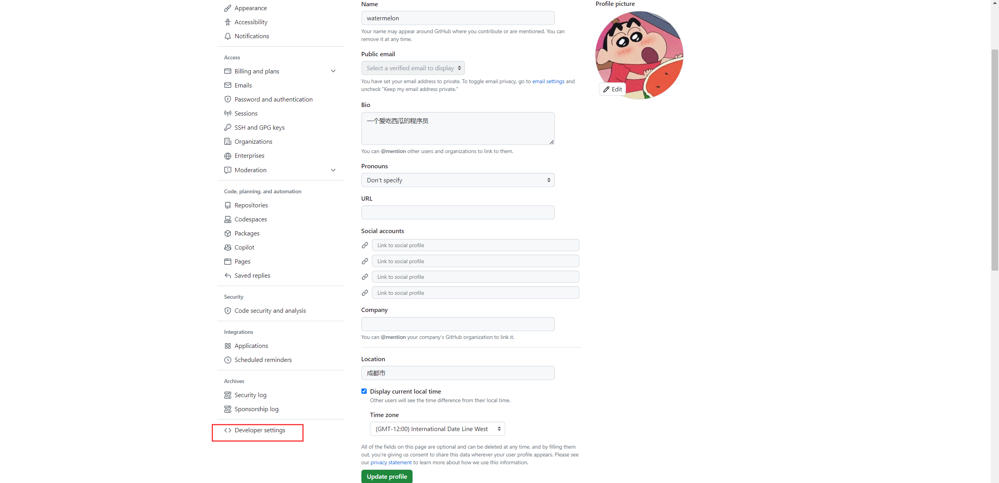
    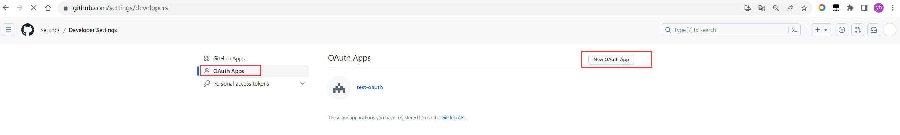
    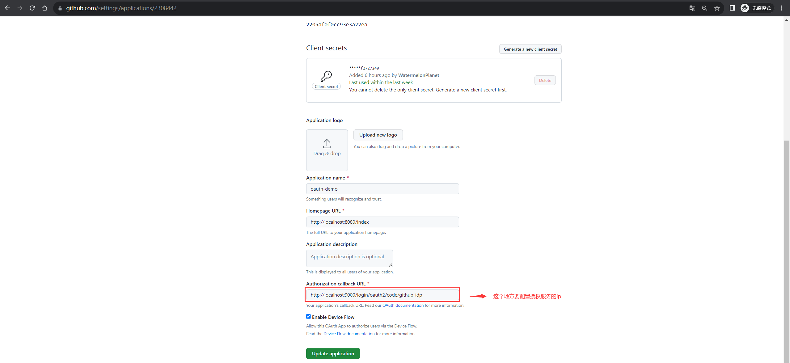
    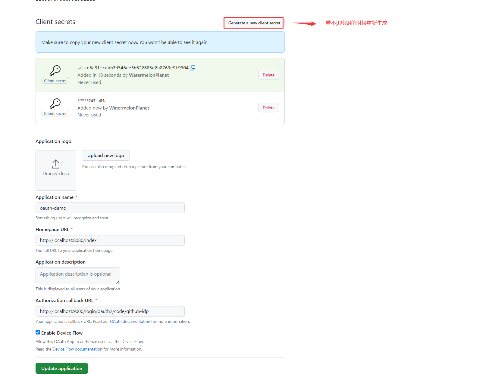
  - [`github oauth 文档链接：https://docs.github.com/en/apps/oauth-apps/building-oauth-apps/authorizing-oauth-apps`](https://docs.github.com/en/apps/oauth-apps/building-oauth-apps/authorizing-oauth-apps)

**2. demo-authorizationserver 的授权服务器配置**
  - 添加oauth配置
    ````yaml
    spring:
      security:
        oauth2:
          client:
            registration:
              github: # 这个唯一就可以了 对应的也就是 {registrationId}
                provider: github # 换个对应如下的 provider
                client-id: 2205af0f0cc93e3a22ea #刚刚创建应用的client-id
                client-secret: 649d88df840a57d2591c4832b438cc9af2727240 #刚刚创建应用的client-secret
                redirect-uri: http://localhost:9000/login/oauth2/code/github # 模板 `{baseUrl}/login/oauth2/code/{registrationId}`
                scope: user:email, read:user #这个可以参考文档根据需要修改
                client-name: Sign in with GitHub
    
            provider:
              github:
                user-name-attribute: login
    ````
  - demo 示例
  
    - 我们现在访问客户端的主页：127.0.0.1:8080/index时，浏览器会重定向到：http://localhost:9000/login
    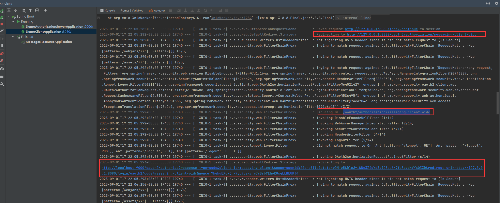
    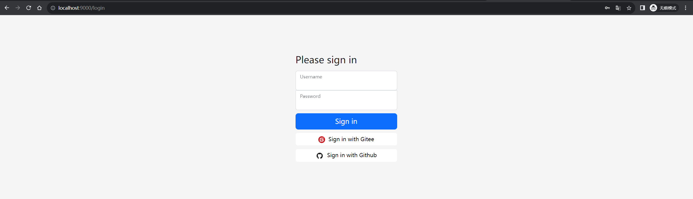  
    - 使用github登录
    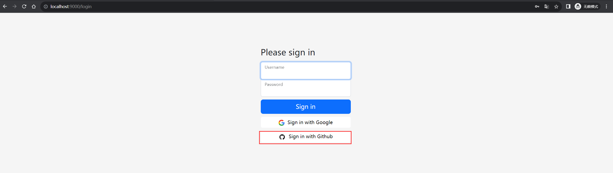
    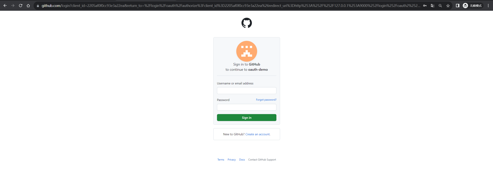
    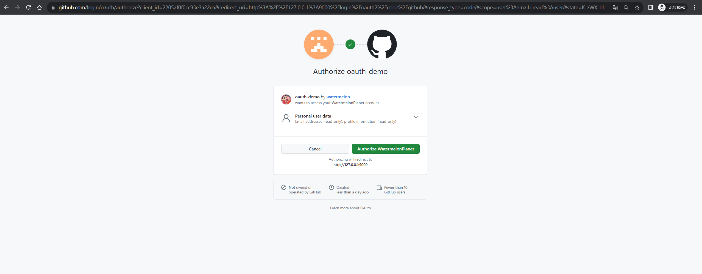
    - 我们自己的授权服务进行授权 
    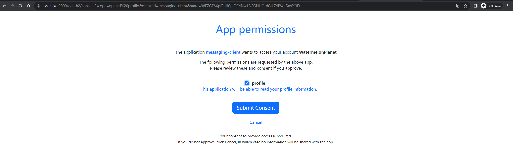
    - 客户端成功访问
     
    - 客户端成功访问资源服务
    
    
**demo-authorizationserver授权服务集成github登录就完成了** 第三方登录配置的回调地址，必须要和授权服务器同一个域下


    [`http://127.0.0.1:9000/login/oauth2/code/github`]()，是spring-security-oauth2-client提供的一个模板 URL [`👉{baseUrl}/login/oauth2/code/{registrationId}`](https://docs.spring.io/spring-security/reference/6.1-SNAPSHOT/reactive/oauth2/login/core.html) 对应 `OAuth2LoginAuthenticationFilter`做后续回调处理， 在spring-security的源码中通过`login/oauth2/code`能搜索到 `OAuth2LoginAuthenticationFilter`。
    /oauth2/authorization/github  /oauth2/authorization/{registrationId}

    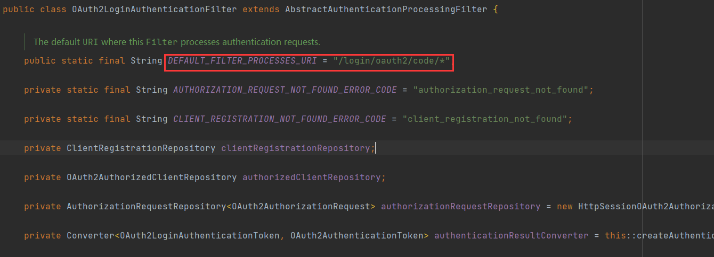
  
