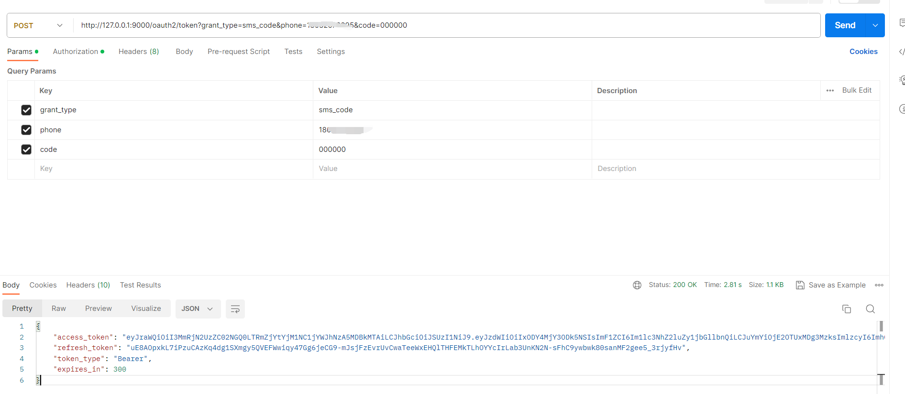
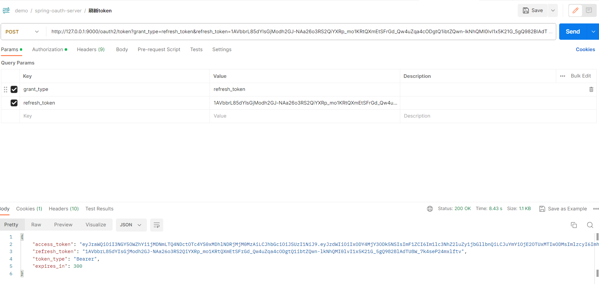

# 😄Spring Authorization Server (6) oauth2授权模式-扩展（手机号+短信验证码）

### 授权码模式

**/oauth2/token**登录的核心代码

````java
public final class OAuth2TokenEndpointFilter extends OncePerRequestFilter {
    /**
     * The default endpoint {@code URI} for access token requests.
     */
    private static final String DEFAULT_TOKEN_ENDPOINT_URI = "/oauth2/token";
    @Override
    protected void doFilterInternal(HttpServletRequest request, HttpServletResponse response, FilterChain filterChain)
            throws ServletException, IOException {
        ...
        try {
            ...
            Authentication authorizationGrantAuthentication = this.authenticationConverter.convert(request);
            if (authorizationGrantAuthentication == null) {
                throwError(OAuth2ErrorCodes.UNSUPPORTED_GRANT_TYPE, OAuth2ParameterNames.GRANT_TYPE);
            }
            if (authorizationGrantAuthentication instanceof AbstractAuthenticationToken) {
                ((AbstractAuthenticationToken) authorizationGrantAuthentication)
                        .setDetails(this.authenticationDetailsSource.buildDetails(request));
            }

            OAuth2AccessTokenAuthenticationToken accessTokenAuthentication =
                    (OAuth2AccessTokenAuthenticationToken) this.authenticationManager.authenticate(authorizationGrantAuthentication);
            this.authenticationSuccessHandler.onAuthenticationSuccess(request, response, accessTokenAuthentication);
        } catch (OAuth2AuthenticationException ex) {
            SecurityContextHolder.clearContext();
            if (this.logger.isTraceEnabled()) {
                this.logger.trace(LogMessage.format("Token request failed: %s", ex.getError()), ex);
            }
            this.authenticationFailureHandler.onAuthenticationFailure(request, response, ex);
        }
    }
}
````

①`Authentication authorizationGrantAuthentication = this.authenticationConverter.convert(request);`

②`OAuth2AccessTokenAuthenticationToken accessTokenAuthentication = (OAuth2AccessTokenAuthenticationToken) this.authenticationManager.authenticate(authorizationGrantAuthentication);`

这2行主要的代码就完成了**授权码模式**的整个认证过程。

#### AuthenticationConverter

````java
public interface AuthenticationConverter {

	Authentication convert(HttpServletRequest request);

}
````

**AuthenticationConverter** 是一个接口，有很多实现类；**授权码模式**对应的是- `OAuth2AuthorizationCodeRequestAuthenticationConverter`的*convert()* 里面做了一些，参数、client_id、scopes等验证最后组装成一个`OAuth2AuthorizationCodeRequestAuthenticationToken`返回。

##### OAuth2AuthorizationCodeRequestAuthenticationConverter

````java
public final class OAuth2AuthorizationCodeRequestAuthenticationConverter implements AuthenticationConverter {

    @Override
    public Authentication convert(HttpServletRequest request) {
        if (!"GET".equals(request.getMethod()) && !OIDC_REQUEST_MATCHER.matches(request)) {
            return null;
        }

        MultiValueMap<String, String> parameters = OAuth2EndpointUtils.getParameters(request);

        // response_type (REQUIRED)
        String responseType = request.getParameter(OAuth2ParameterNames.RESPONSE_TYPE);
        if (!StringUtils.hasText(responseType) ||
                parameters.get(OAuth2ParameterNames.RESPONSE_TYPE).size() != 1) {
            throwError(OAuth2ErrorCodes.INVALID_REQUEST, OAuth2ParameterNames.RESPONSE_TYPE);
        } else if (!responseType.equals(OAuth2AuthorizationResponseType.CODE.getValue())) {
            throwError(OAuth2ErrorCodes.UNSUPPORTED_RESPONSE_TYPE, OAuth2ParameterNames.RESPONSE_TYPE);
        }

        String authorizationUri = request.getRequestURL().toString();

        // client_id (REQUIRED)
        String clientId = parameters.getFirst(OAuth2ParameterNames.CLIENT_ID);
        if (!StringUtils.hasText(clientId) ||
                parameters.get(OAuth2ParameterNames.CLIENT_ID).size() != 1) {
            throwError(OAuth2ErrorCodes.INVALID_REQUEST, OAuth2ParameterNames.CLIENT_ID);
        }

        Authentication principal = SecurityContextHolder.getContext().getAuthentication();
        if (principal == null) {
            principal = ANONYMOUS_AUTHENTICATION;
        }

        // redirect_uri (OPTIONAL)
        String redirectUri = parameters.getFirst(OAuth2ParameterNames.REDIRECT_URI);
        if (StringUtils.hasText(redirectUri) &&
                parameters.get(OAuth2ParameterNames.REDIRECT_URI).size() != 1) {
            throwError(OAuth2ErrorCodes.INVALID_REQUEST, OAuth2ParameterNames.REDIRECT_URI);
        }

        // scope (OPTIONAL)
        Set<String> scopes = null;
        String scope = parameters.getFirst(OAuth2ParameterNames.SCOPE);
        if (StringUtils.hasText(scope) &&
                parameters.get(OAuth2ParameterNames.SCOPE).size() != 1) {
            throwError(OAuth2ErrorCodes.INVALID_REQUEST, OAuth2ParameterNames.SCOPE);
        }
        if (StringUtils.hasText(scope)) {
            scopes = new HashSet<>(
                    Arrays.asList(StringUtils.delimitedListToStringArray(scope, " ")));
        }

        // state (RECOMMENDED)
        String state = parameters.getFirst(OAuth2ParameterNames.STATE);
        if (StringUtils.hasText(state) &&
                parameters.get(OAuth2ParameterNames.STATE).size() != 1) {
            throwError(OAuth2ErrorCodes.INVALID_REQUEST, OAuth2ParameterNames.STATE);
        }

        // code_challenge (REQUIRED for public clients) - RFC 7636 (PKCE)
        String codeChallenge = parameters.getFirst(PkceParameterNames.CODE_CHALLENGE);
        if (StringUtils.hasText(codeChallenge) &&
                parameters.get(PkceParameterNames.CODE_CHALLENGE).size() != 1) {
            throwError(OAuth2ErrorCodes.INVALID_REQUEST, PkceParameterNames.CODE_CHALLENGE, PKCE_ERROR_URI);
        }

        // code_challenge_method (OPTIONAL for public clients) - RFC 7636 (PKCE)
        String codeChallengeMethod = parameters.getFirst(PkceParameterNames.CODE_CHALLENGE_METHOD);
        if (StringUtils.hasText(codeChallengeMethod) &&
                parameters.get(PkceParameterNames.CODE_CHALLENGE_METHOD).size() != 1) {
            throwError(OAuth2ErrorCodes.INVALID_REQUEST, PkceParameterNames.CODE_CHALLENGE_METHOD, PKCE_ERROR_URI);
        }

        Map<String, Object> additionalParameters = new HashMap<>();
        parameters.forEach((key, value) -> {
            if (!key.equals(OAuth2ParameterNames.RESPONSE_TYPE) &&
                    !key.equals(OAuth2ParameterNames.CLIENT_ID) &&
                    !key.equals(OAuth2ParameterNames.REDIRECT_URI) &&
                    !key.equals(OAuth2ParameterNames.SCOPE) &&
                    !key.equals(OAuth2ParameterNames.STATE)) {
                additionalParameters.put(key, (value.size() == 1) ? value.get(0) : value.toArray(new String[0]));
            }
        });

        return new OAuth2AuthorizationCodeRequestAuthenticationToken(authorizationUri, clientId, principal,
                redirectUri, state, scopes, additionalParameters);
    }

}
````

##### OAuth2AuthorizationCodeRequestAuthenticationToken

````java
public class OAuth2AuthorizationCodeRequestAuthenticationToken extends AbstractAuthenticationToken {
    private static final long serialVersionUID = SpringAuthorizationServerVersion.SERIAL_VERSION_UID;
    private final String authorizationUri;
    private final String clientId;
    private final Authentication principal;
    private final String redirectUri;
    private final String state;
    private final Set<String> scopes;
    private final Map<String, Object> additionalParameters;
    private final OAuth2AuthorizationCode authorizationCode;
    .....
}
````

发现它们的命名都和被实现接口或被继承类名称有点类似，点进去看它们的父类就是接口或抽象类对应有很多的实现

### AuthenticationManager

````java
public interface AuthenticationManager {
	Authentication authenticate(Authentication authentication) throws AuthenticationException;
}
````

**AuthenticationManager** 也是一个接口，默认的实现类是`ProviderManager`

#### ProviderManager

````java
public class ProviderManager implements AuthenticationManager, MessageSourceAware, InitializingBean {
    ...省略了后部分代码
  
    @Override
    public Authentication authenticate(Authentication authentication) throws AuthenticationException {
        Class<? extends Authentication> toTest = authentication.getClass();
        AuthenticationException lastException = null;
        AuthenticationException parentException = null;
        Authentication result = null;
        Authentication parentResult = null;
        int currentPosition = 0;
        int size = this.providers.size();
        for (AuthenticationProvider provider : getProviders()) {
            if (!provider.supports(toTest)) {
                continue;
            }
            if (logger.isTraceEnabled()) {
                logger.trace(LogMessage.format("Authenticating request with %s (%d/%d)",
                        provider.getClass().getSimpleName(), ++currentPosition, size));
            }
            try {
                result = provider.authenticate(authentication);
                if (result != null) {
                    copyDetails(authentication, result);
                    break;
                }
            } catch (AccountStatusException | InternalAuthenticationServiceException ex) {
                prepareException(ex, authentication);
                // SEC-546: Avoid polling additional providers if auth failure is due to
                // invalid account status
                throw ex;
            } catch (AuthenticationException ex) {
                lastException = ex;
            }
        }
        ...省略了后半部分代码
    }
}
````

for循环在进行匹配对应的 **provider**去执行*authenticate()*

````java
for(AuthenticationProvider provider:getProviders()){
        if(!provider.supports(toTest)){
        continue;
        }
 }
````

##### AuthenticationProvider

`*Provider`都会实现 `AuthenticationProvider`这个接口，`authenticate()`认证的核心逻辑在里面去实现，`supports()`匹配对应的 Provider

````java
public interface AuthenticationProvider {
  
	Authentication authenticate(Authentication authentication) throws AuthenticationException;

	boolean supports(Class<?> authentication);

}

````

最终匹配上的`OAuth2AuthorizationCodeRequestAuthenticationProvider`了，也是实现了`AuthenticationProvider`接口的

##### OAuth2AuthorizationCodeRequestAuthenticationProvider

````java
public final class OAuth2AuthorizationCodeRequestAuthenticationProvider implements AuthenticationProvider {
    @Override
    public Authentication authenticate(Authentication authentication) throws AuthenticationException {
        OAuth2AuthorizationCodeRequestAuthenticationToken authorizationCodeRequestAuthentication =
                (OAuth2AuthorizationCodeRequestAuthenticationToken) authentication;

        RegisteredClient registeredClient = this.registeredClientRepository.findByClientId(
                authorizationCodeRequestAuthentication.getClientId());
        if (registeredClient == null) {
            throwError(OAuth2ErrorCodes.INVALID_REQUEST, OAuth2ParameterNames.CLIENT_ID,
                    authorizationCodeRequestAuthentication, null);
        }

        if (this.logger.isTraceEnabled()) {
            this.logger.trace("Retrieved registered client");
        }

        OAuth2AuthorizationCodeRequestAuthenticationContext authenticationContext =
                OAuth2AuthorizationCodeRequestAuthenticationContext.with(authorizationCodeRequestAuthentication)
                        .registeredClient(registeredClient)
                        .build();
        this.authenticationValidator.accept(authenticationContext);

        if (!registeredClient.getAuthorizationGrantTypes().contains(AuthorizationGrantType.AUTHORIZATION_CODE)) {
            throwError(OAuth2ErrorCodes.UNAUTHORIZED_CLIENT, OAuth2ParameterNames.CLIENT_ID,
                    authorizationCodeRequestAuthentication, registeredClient);
        }

        // code_challenge (REQUIRED for public clients) - RFC 7636 (PKCE)
        String codeChallenge = (String) authorizationCodeRequestAuthentication.getAdditionalParameters().get(PkceParameterNames.CODE_CHALLENGE);
        if (StringUtils.hasText(codeChallenge)) {
            String codeChallengeMethod = (String) authorizationCodeRequestAuthentication.getAdditionalParameters().get(PkceParameterNames.CODE_CHALLENGE_METHOD);
            if (!StringUtils.hasText(codeChallengeMethod) || !"S256".equals(codeChallengeMethod)) {
                throwError(OAuth2ErrorCodes.INVALID_REQUEST, PkceParameterNames.CODE_CHALLENGE_METHOD, PKCE_ERROR_URI,
                        authorizationCodeRequestAuthentication, registeredClient, null);
            }
        } else if (registeredClient.getClientSettings().isRequireProofKey()) {
            throwError(OAuth2ErrorCodes.INVALID_REQUEST, PkceParameterNames.CODE_CHALLENGE, PKCE_ERROR_URI,
                    authorizationCodeRequestAuthentication, registeredClient, null);
        }

        if (this.logger.isTraceEnabled()) {
            this.logger.trace("Validated authorization code request parameters");
        }

        // ---------------
        // The request is valid - ensure the resource owner is authenticated
        // ---------------

        Authentication principal = (Authentication) authorizationCodeRequestAuthentication.getPrincipal();
        if (!isPrincipalAuthenticated(principal)) {
            if (this.logger.isTraceEnabled()) {
                this.logger.trace("Did not authenticate authorization code request since principal not authenticated");
            }
            // Return the authorization request as-is where isAuthenticated() is false
            return authorizationCodeRequestAuthentication;
        }

        OAuth2AuthorizationRequest authorizationRequest = OAuth2AuthorizationRequest.authorizationCode()
                .authorizationUri(authorizationCodeRequestAuthentication.getAuthorizationUri())
                .clientId(registeredClient.getClientId())
                .redirectUri(authorizationCodeRequestAuthentication.getRedirectUri())
                .scopes(authorizationCodeRequestAuthentication.getScopes())
                .state(authorizationCodeRequestAuthentication.getState())
                .additionalParameters(authorizationCodeRequestAuthentication.getAdditionalParameters())
                .build();

        OAuth2AuthorizationConsent currentAuthorizationConsent = this.authorizationConsentService.findById(
                registeredClient.getId(), principal.getName());

        if (requireAuthorizationConsent(registeredClient, authorizationRequest, currentAuthorizationConsent)) {
            String state = DEFAULT_STATE_GENERATOR.generateKey();
            OAuth2Authorization authorization = authorizationBuilder(registeredClient, principal, authorizationRequest)
                    .attribute(OAuth2ParameterNames.STATE, state)
                    .build();

            if (this.logger.isTraceEnabled()) {
                logger.trace("Generated authorization consent state");
            }

            this.authorizationService.save(authorization);

            Set<String> currentAuthorizedScopes = currentAuthorizationConsent != null ?
                    currentAuthorizationConsent.getScopes() : null;

            if (this.logger.isTraceEnabled()) {
                this.logger.trace("Saved authorization");
            }

            return new OAuth2AuthorizationConsentAuthenticationToken(authorizationRequest.getAuthorizationUri(),
                    registeredClient.getClientId(), principal, state, currentAuthorizedScopes, null);
        }

        OAuth2TokenContext tokenContext = createAuthorizationCodeTokenContext(
                authorizationCodeRequestAuthentication, registeredClient, null, authorizationRequest.getScopes());
        OAuth2AuthorizationCode authorizationCode = this.authorizationCodeGenerator.generate(tokenContext);
        if (authorizationCode == null) {
            OAuth2Error error = new OAuth2Error(OAuth2ErrorCodes.SERVER_ERROR,
                    "The token generator failed to generate the authorization code.", ERROR_URI);
            throw new OAuth2AuthorizationCodeRequestAuthenticationException(error, null);
        }

        if (this.logger.isTraceEnabled()) {
            this.logger.trace("Generated authorization code");
        }

        OAuth2Authorization authorization = authorizationBuilder(registeredClient, principal, authorizationRequest)
                .authorizedScopes(authorizationRequest.getScopes())
                .token(authorizationCode)
                .build();
        this.authorizationService.save(authorization);

        if (this.logger.isTraceEnabled()) {
            this.logger.trace("Saved authorization");
        }

        String redirectUri = authorizationRequest.getRedirectUri();
        if (!StringUtils.hasText(redirectUri)) {
            redirectUri = registeredClient.getRedirectUris().iterator().next();
        }

        if (this.logger.isTraceEnabled()) {
            this.logger.trace("Authenticated authorization code request");
        }

        return new OAuth2AuthorizationCodeRequestAuthenticationToken(authorizationRequest.getAuthorizationUri(),
                registeredClient.getClientId(), principal, authorizationCode, redirectUri,
                authorizationRequest.getState(), authorizationRequest.getScopes());
    }
 
    //这个是 provider.supports(toTest)的实现
    @Override
    public boolean supports(Class<?> authentication) {
        return OAuth2AuthorizationCodeRequestAuthenticationToken.class.isAssignableFrom(authentication);
    }

}
````

以上就是**授权码模式**认证的核心代码了，那么我们都知道这个这个 **授权码模式** 是怎么玩的了，那我们也仿造它们的方式来吧，接下来就来扩展一个 **手机号+短信验证码**

### 手机号+短信验证码模式

#### AuthorizationServerConfigurationConsent
定义的一些常量
````java
public static final String CUSTOM_CONSENT_PAGE_URI = "/oauth2/consent";

    public static final String GRANT_TYPE_SMS_CODE = "sms_code";

    public static final String OAUTH2_PARAMETER_NAME_PHONE = "phone";

    public static final String OAUTH2_PARAMETER_NAME_SMS_CODE = "code";

    public static final String OAUTH2_THIRD_LOGIN_PLATFORM_USER_INFO_PARAMETER = "user_info";
}
````
#### SmsAuthenticationToken
````java
public class SmsAuthenticationToken extends AbstractAuthenticationToken {
    /**
     * 认证类型
     */
    private AuthorizationGrantType authorizationGrantType;
    /**
     * 用户名
     */
    private Authentication clientPrincipal;
    /**
     * 手机号
     */
    private String phone;
    /**
     * scopes
     */
    private Set<String> scopes;
    /**
     * 扩展的参数
     */
    private Map<String, Object> additionalParameters;

    public SmsAuthenticationToken(
            AuthorizationGrantType authorizationGrantType,
            Authentication clientPrincipal,
            Set<String> scopes,
            String phone,
            Map<String, Object> additionalParameters) {
        super(Collections.emptyList());

        Assert.notNull(clientPrincipal, "clientPrincipal cannot be null");
        this.scopes = Collections.unmodifiableSet(
                scopes != null ?
                        new HashSet<>(scopes) :
                        Collections.emptySet());

        this.phone = phone;
        this.clientPrincipal = clientPrincipal;
        this.additionalParameters = Collections.unmodifiableMap(
                additionalParameters != null ?
                        new HashMap<>(additionalParameters) :
                        Collections.emptyMap());
        this.authorizationGrantType = authorizationGrantType;
    }
    /**
     * 扩展模式一般不需要密码
     */
    @Override
    public Object getCredentials() {
        return null;
    }
    /**
     * 获取用户名
     */
    @Override
    public Object getPrincipal() {
        return this.clientPrincipal;
    }
    public String getPhone() {
        return phone;
    }
    /**
     * 获取请求的scopes
     */
    public Set<String> getScopes() {
        return this.scopes;
    }
    /**
     * 获取请求中的 grant_type
     */
    public AuthorizationGrantType getAuthorizationGrantType() {
        return this.authorizationGrantType;
    }
    /**
     * 获取请求中的附加参数
     */
    public Map<String, Object> getAdditionalParameters() {
        return this.additionalParameters;
    }
}

````
#### SmsAuthenticationConverter
实现 `AuthenticationConverter`接口的`convert(HttpServletRequest)`方法，里面做参数的一些校验了，然后把它转换成`AbstractAuthenticationToken` 返回，
以便后面的**Provider**使用。
````java
public final class SmsAuthenticationConverter implements AuthenticationConverter {

    @Nullable
    @Override
    public Authentication convert(HttpServletRequest request) {
        // grant_type (REQUIRED)
        String grantType = request.getParameter(OAuth2ParameterNames.GRANT_TYPE);
        if (!AuthorizationServerConfigurationConsent.GRANT_TYPE_SMS_CODE.equals(grantType)) {
            return null;
        }
        Authentication clientPrincipal = SecurityContextHolder.getContext().getAuthentication();
        //OAuth2AuthorizationUtils 是copy 源码中存在的
        MultiValueMap<String, String> parameters = OAuth2AuthorizationUtils.getParameters(request);


        // scope (OPTIONAL)
        Set<String> scopes = null;
        String scope = parameters.getFirst(OAuth2ParameterNames.SCOPE);
        if (StringUtils.hasText(scope) &&
                parameters.get(OAuth2ParameterNames.SCOPE).size() != 1) {
            OAuth2AuthorizationUtils.throwError(OAuth2ErrorCodes.INVALID_REQUEST, OAuth2ParameterNames.SCOPE, null);
        }
        if (StringUtils.hasText(scope)) {
            scopes = new HashSet<>(
                    Arrays.asList(StringUtils.delimitedListToStringArray(scope, " ")));
        }
        // phone (REQUIRED) 手机号
        String phone = parameters.getFirst(AuthorizationServerConfigurationConsent.OAUTH2_PARAMETER_NAME_PHONE);
        if (!StringUtils.hasText(phone) ||
                parameters.get(AuthorizationServerConfigurationConsent.OAUTH2_PARAMETER_NAME_PHONE).size() != 1) {
            OAuth2AuthorizationUtils.throwError(
                    OAuth2ErrorCodes.INVALID_REQUEST,
                    "OAuth 2.0 Parameter: " + AuthorizationServerConfigurationConsent.OAUTH2_PARAMETER_NAME_PHONE,
                    null);
        }
        // sms_code (REQUIRED) 验证码必填
        //todo 这个地方也可以做验证码是否正确的判断了。或者在后面的Provider做验证也是可以的
        String smsCode = parameters.getFirst(AuthorizationServerConfigurationConsent.OAUTH2_PARAMETER_NAME_SMS_CODE);
        if (!StringUtils.hasText(smsCode) ||
                parameters.get(AuthorizationServerConfigurationConsent.OAUTH2_PARAMETER_NAME_SMS_CODE).size() != 1) {
            OAuth2AuthorizationUtils.throwError(
                    OAuth2ErrorCodes.INVALID_REQUEST,
                    "OAuth 2.0 Parameter: " + AuthorizationServerConfigurationConsent.OAUTH2_PARAMETER_NAME_SMS_CODE,
                    null);
        }
        //扩展参数
        Map<String, Object> additionalParameters = new HashMap<>();
        parameters.forEach((key, value) -> {
            if (!key.equals(OAuth2ParameterNames.GRANT_TYPE)) {
                additionalParameters.put(key, value.get(0));
            }
        });
        return new SmsAuthenticationToken(new AuthorizationGrantType(AuthorizationServerConfigurationConsent.GRANT_TYPE_SMS_CODE),
                clientPrincipal,
                scopes,
                phone,
                additionalParameters);
    }
}
````
#### SmsAuthenticationProvider
````java
Slf4j
public final class SmsAuthenticationProvider implements AuthenticationProvider {

    private static final String ERROR_URI = "https://datatracker.ietf.org/doc/html/rfc6749#section-3.2.1";

    private OAuth2AuthorizationService authorizationService;

    private OAuth2TokenGenerator<? extends OAuth2Token> tokenGenerator;

    private AuthenticationManager authenticationManager;//暂时没有用到 如果额外加一个 短信验证码的 Provider 参考 DaoAuthenticationProvider

    private static final OAuth2TokenType ID_TOKEN_TOKEN_TYPE =
            new OAuth2TokenType(OidcParameterNames.ID_TOKEN);


    @Override
    public Authentication authenticate(Authentication authentication) throws AuthenticationException {

        SmsAuthenticationToken smsAuthenticationToken = (SmsAuthenticationToken) authentication;

        OAuth2ClientAuthenticationToken clientPrincipal =
                OAuth2AuthorizationUtils.getAuthenticatedClientElseThrowInvalidClient(smsAuthenticationToken);

        RegisteredClient registeredClient = clientPrincipal.getRegisteredClient();
        if (log.isTraceEnabled()) {
            log.trace("Retrieved registered client");
        }
        if (registeredClient == null) {
            throw new OAuth2AuthenticationException("client_id not exist");
        }

        try {
            SmsCodeValidAuthenticationToken smsCodeValidAuthenticationToken = new SmsCodeValidAuthenticationToken(smsAuthenticationToken.getPhone(), smsAuthenticationToken.getCode());
            Authentication smsCodeValidAuthentication = authenticationManager.authenticate(smsCodeValidAuthenticationToken);
            // @formatter:off
            DefaultOAuth2TokenContext.Builder tokenContextBuilder = DefaultOAuth2TokenContext.builder()
                    .registeredClient(registeredClient)
                    .principal(smsCodeValidAuthentication)
                    .authorizationServerContext(AuthorizationServerContextHolder.getContext())
                    .authorizedScopes(smsAuthenticationToken.getScopes())
                    .authorizationGrantType(smsAuthenticationToken.getAuthorizationGrantType())
                    .authorizationGrant(smsAuthenticationToken);
            // @formatter:on
            OAuth2Authorization.Builder authorizationBuilder = OAuth2Authorization
                    .withRegisteredClient(registeredClient)
                    .principalName(smsCodeValidAuthentication.getName())
                    .authorizationGrantType(smsAuthenticationToken.getAuthorizationGrantType())
                    .authorizedScopes(smsAuthenticationToken.getScopes());

            // ----- Access token -----
            OAuth2TokenContext tokenContext = tokenContextBuilder.tokenType(OAuth2TokenType.ACCESS_TOKEN).build();
            OAuth2Token generatedAccessToken = this.tokenGenerator.generate(tokenContext);
            if (generatedAccessToken == null) {
                OAuth2Error error = new OAuth2Error(OAuth2ErrorCodes.SERVER_ERROR,
                        "The token generator failed to generate the access token.", ERROR_URI);
                throw new OAuth2AuthenticationException(error);
            }

            if (log.isTraceEnabled()) {
                log.trace("Generated access token");
            }

            OAuth2AccessToken accessToken = new OAuth2AccessToken(OAuth2AccessToken.TokenType.BEARER,
                    generatedAccessToken.getTokenValue(), generatedAccessToken.getIssuedAt(),
                    generatedAccessToken.getExpiresAt(), tokenContext.getAuthorizedScopes());
            if (generatedAccessToken instanceof ClaimAccessor) {
                authorizationBuilder.token(accessToken, (metadata) ->
                                metadata.put(OAuth2Authorization.Token.CLAIMS_METADATA_NAME, ((ClaimAccessor) generatedAccessToken).getClaims()))
                        .attribute(Principal.class.getName(), smsCodeValidAuthentication);
            } else {
                authorizationBuilder.accessToken(accessToken);
            }

            // ----- Refresh token -----
            OAuth2RefreshToken refreshToken = null;
            if (registeredClient.getAuthorizationGrantTypes().contains(AuthorizationGrantType.REFRESH_TOKEN) &&
                    // Do not issue refresh token to public client
                    !clientPrincipal.getClientAuthenticationMethod().equals(ClientAuthenticationMethod.NONE)) {

                tokenContext = tokenContextBuilder.tokenType(OAuth2TokenType.REFRESH_TOKEN).build();
                OAuth2Token generatedRefreshToken = this.tokenGenerator.generate(tokenContext);
                if (!(generatedRefreshToken instanceof OAuth2RefreshToken)) {
                    OAuth2Error error = new OAuth2Error(OAuth2ErrorCodes.SERVER_ERROR,
                            "The token generator failed to generate the refresh token.", ERROR_URI);
                    throw new OAuth2AuthenticationException(error);
                }

                if (log.isTraceEnabled()) {
                    log.trace("Generated refresh token");
                }

                refreshToken = (OAuth2RefreshToken) generatedRefreshToken;
                authorizationBuilder.refreshToken(refreshToken);
            }

            // ----- ID token -----
            OidcIdToken idToken;
            if (smsAuthenticationToken.getScopes().contains(OidcScopes.OPENID)) {

                // @formatter:off
                tokenContext = tokenContextBuilder
                        .tokenType(ID_TOKEN_TOKEN_TYPE)
                        .authorization(authorizationBuilder.build())    // ID token customizer may need access to the access token and/or refresh token
                        .build();
                // @formatter:on
                OAuth2Token generatedIdToken = this.tokenGenerator.generate(tokenContext);
                if (!(generatedIdToken instanceof Jwt)) {
                    OAuth2Error error = new OAuth2Error(OAuth2ErrorCodes.SERVER_ERROR,
                            "The token generator failed to generate the ID token.", ERROR_URI);
                    throw new OAuth2AuthenticationException(error);
                }

                if (log.isTraceEnabled()) {
                    log.trace("Generated id token");
                }

                idToken = new OidcIdToken(generatedIdToken.getTokenValue(), generatedIdToken.getIssuedAt(),
                        generatedIdToken.getExpiresAt(), ((Jwt) generatedIdToken).getClaims());
                authorizationBuilder.token(idToken, (metadata) ->
                        metadata.put(OAuth2Authorization.Token.CLAIMS_METADATA_NAME, idToken.getClaims()));
            } else {
                idToken = null;
            }

            OAuth2Authorization authorization = authorizationBuilder.build();


            this.authorizationService.save(authorization);

            if (log.isTraceEnabled()) {
                log.trace("Saved authorization");
            }

            Map<String, Object> additionalParameters = Collections.emptyMap();
            if (idToken != null) {
                additionalParameters = new HashMap<>();
                additionalParameters.put(OidcParameterNames.ID_TOKEN, idToken.getTokenValue());
            }

            if (log.isTraceEnabled()) {
                log.trace("Authenticated token request");
            }

            return new OAuth2AccessTokenAuthenticationToken(
                    registeredClient, clientPrincipal, accessToken, refreshToken, additionalParameters);
        } catch (Exception e) {

            OAuth2Error error = new OAuth2Error(OAuth2ErrorCodes.SERVER_ERROR,
                    e.getMessage(), ERROR_URI);

            throw new OAuth2AuthenticationException(error);
        }

    }

    @Override
    public boolean supports(Class<?> authentication) {
        return SmsAuthenticationToken.class.isAssignableFrom(authentication);
    }


    public void setTokenGenerator(OAuth2TokenGenerator<?> tokenGenerator) {
        Assert.notNull(tokenGenerator, "tokenGenerator cannot be null");
        this.tokenGenerator = tokenGenerator;
    }

    public void setAuthenticationManager(AuthenticationManager authenticationManager) {
        Assert.notNull(authorizationService, "authenticationManager cannot be null");
        this.authenticationManager = authenticationManager;
    }

    public void setAuthorizationService(OAuth2AuthorizationService authorizationService) {
        Assert.notNull(authorizationService, "authorizationService cannot be null");
        this.authorizationService = authorizationService;
    }

}

````

#### SmsCodeValidAuthenticationToken
````java
public class SmsCodeValidAuthenticationToken extends AbstractAuthenticationToken {

    private static final long serialVersionUID = SpringSecurityCoreVersion.SERIAL_VERSION_UID;
    /**
     * 手机号
     */
    private final String phone;
    /**
     * 验证码
     */
    private final String code;

    public SmsCodeValidAuthenticationToken(String phone, String code) {
        super(null);
        this.phone = phone;
        this.code = code;
    }


    @Override
    public Object getCredentials() {
        return null;
    }

    @Override
    public Object getPrincipal() {
        return phone;
    }

    public String getPhone() {
        return phone;
    }

    public String getCode() {
        return code;
    }
}
````

#### SmsCodeValidAuthenticationProvider
````java
public class SmsCodeValidAuthenticationProvider implements AuthenticationProvider {


    @Override
    public Authentication authenticate(Authentication authentication) throws AuthenticationException {
        SmsCodeValidAuthenticationToken smsCodeValidAuthenticationToken = (SmsCodeValidAuthenticationToken) authentication;
        String phone = smsCodeValidAuthenticationToken.getPhone();
        //验证码
        String code = smsCodeValidAuthenticationToken.getCode();
        if(!StringUtils.hasText(code)){
            throw new OAuth2AuthenticationException("验证码不能为空!");
        }
        //todo 暂时先写000000 ，发送验证码的我们还没有写的
        if (!code.equals("000000")) {
            throw new OAuth2AuthenticationException("验证码：【"+code+"】已过期!");
        }
        //使用 UsernamePasswordAuthenticationToken 返回
        return new UsernamePasswordAuthenticationToken(phone, null);   
    }

    @Override
    public boolean supports(Class<?> authentication) {
        return SmsCodeValidAuthenticationToken.class.isAssignableFrom(authentication);
    }
}
````

当然也可以在 `SmsAuthenticationProvider`中或者`SmsAuthenticationConverter`去做验证码校验，新创建一个`SmsCodeValidAuthenticationProvider`的原因是为了和它本身的流程保持一致，用户名和密码登录时密码匹配是在`DaoAuthenticationProvider`中进行的，所以也在我也在`Provider`去做校验。

#### AuthorizationServerConfig

`AuthorizationServerConfig`修改后的代码如下，主要是改动是将Converter、Provider 添加到过滤器链中。

````java
@Configuration(proxyBeanMethods = false)
public class AuthorizationServerConfig {
    
    private static final String CUSTOM_CONSENT_PAGE_URI = "/oauth2/consent";//这个是授权页

    @Bean
    @Order(Ordered.HIGHEST_PRECEDENCE)
    public SecurityFilterChain authorizationServerSecurityFilterChain(
            HttpSecurity http, RegisteredClientRepository registeredClientRepository,
            AuthorizationServerSettings authorizationServerSettings) throws Exception {

        OAuth2AuthorizationServerConfiguration.applyDefaultSecurity(http);

        DeviceClientAuthenticationConverter deviceClientAuthenticationConverter =
                new DeviceClientAuthenticationConverter(
                        authorizationServerSettings.getDeviceAuthorizationEndpoint());
        DeviceClientAuthenticationProvider deviceClientAuthenticationProvider =
                new DeviceClientAuthenticationProvider(registeredClientRepository);

        // @formatter:off
        http.getConfigurer(OAuth2AuthorizationServerConfigurer.class)
                .deviceAuthorizationEndpoint(deviceAuthorizationEndpoint ->
                        deviceAuthorizationEndpoint.verificationUri("/activate")
                )
                .deviceVerificationEndpoint(deviceVerificationEndpoint ->
                        deviceVerificationEndpoint.consentPage(CUSTOM_CONSENT_PAGE_URI)
                )
                .clientAuthentication(clientAuthentication ->
                        clientAuthentication
                                .authenticationConverter(deviceClientAuthenticationConverter)
                                .authenticationProvider(deviceClientAuthenticationProvider)
                )
                .authorizationEndpoint(authorizationEndpoint ->
                        authorizationEndpoint.consentPage(CUSTOM_CONSENT_PAGE_URI))
                .oidc(Customizer.withDefaults());    // Enable OpenID Connect 1.0
        // @formatter:on

        // @formatter:off
        http
                .exceptionHandling((exceptions) -> exceptions
                        .defaultAuthenticationEntryPointFor(
                                new LoginUrlAuthenticationEntryPoint("/login"),
                                new MediaTypeRequestMatcher(MediaType.TEXT_HTML)
                        )
                )
                .oauth2ResourceServer(oauth2ResourceServer ->
                        oauth2ResourceServer.jwt(Customizer.withDefaults()));
        // @formatter:on

        //sms off
        SmsAuthenticationConverter smsAuthenticationConverter = new SmsAuthenticationConverter();
        SmsAuthenticationProvider smsAuthenticationProvider = new SmsAuthenticationProvider();
        SmsCodeValidAuthenticationProvider smsCodeValidAuthenticationProvider = new SmsCodeValidAuthenticationProvider();
        //sms on
        http.getConfigurer(OAuth2AuthorizationServerConfigurer.class)
                .tokenEndpoint(tokenEndpoint->
                        tokenEndpoint.accessTokenRequestConverter(smsAuthenticationConverter)
                                     .authenticationProvider(smsAuthenticationProvider)//选择追加的方式
                                    .authenticationProvider(smsCodeValidAuthenticationProvider)

                );
        DefaultSecurityFilterChain build = http.build();
        this.initAuthenticationProviderFiled(http, smsAuthenticationProvider, smsCodeValidAuthenticationProvider);
        return build;
    }


    @Bean
    public OAuth2AuthorizationService authorizationService(JdbcTemplate jdbcTemplate,
                                                           RegisteredClientRepository registeredClientRepository) {
        return new JdbcOAuth2AuthorizationService(jdbcTemplate, registeredClientRepository);
    }

    @Bean
    public OAuth2AuthorizationConsentService authorizationConsentService(JdbcTemplate jdbcTemplate, RegisteredClientRepository registeredClientRepository) {
        return new JdbcOAuth2AuthorizationConsentService(jdbcTemplate, registeredClientRepository);
    }

    @Bean
    public OAuth2TokenCustomizer<JwtEncodingContext> idTokenCustomizer() {
        return new FederatedIdentityIdTokenCustomizer();
    }

    @Bean
    public JWKSource<SecurityContext> jwkSource() {
        RSAKey rsaKey = Jwks.generateRsa();
        JWKSet jwkSet = new JWKSet(rsaKey);
        return (jwkSelector, securityContext) -> jwkSelector.select(jwkSet);
    }

    @Bean
    public JwtDecoder jwtDecoder(JWKSource<SecurityContext> jwkSource) {
        return OAuth2AuthorizationServerConfiguration.jwtDecoder(jwkSource);
    }

    @Bean
    public AuthorizationServerSettings authorizationServerSettings() {
        return AuthorizationServerSettings.builder().build();
    }


    /**
     * 初始化  Provider 中的 OAuth2TokenGenerator、AuthenticationManager、OAuth2AuthorizationService 属性
     * @param http
     * @param providers
     */
    private void initAuthenticationProviderFiled(HttpSecurity http, AuthenticationProvider... providers) {
        //http.build 之后 Spring Security过滤器链才完整构建 这个时候才能从中获取到以下想要获取到的class实例（其他方法后面有时间再试一试）
        OAuth2TokenGenerator<?> tokenGenerator = http.getSharedObject(OAuth2TokenGenerator.class);
        AuthenticationManager authenticationManager = http.getSharedObject(AuthenticationManager.class);
        OAuth2AuthorizationService authorizationService = http.getSharedObject(OAuth2AuthorizationService.class);
        for (AuthenticationProvider provider : providers) {
            if (provider instanceof SmsAuthenticationProvider smsAuthenticationProvider) {
                //这个class需要用到依赖
                smsAuthenticationProvider.setAuthorizationService(authorizationService);
                smsAuthenticationProvider.setTokenGenerator(tokenGenerator);
                smsAuthenticationProvider.setAuthenticationManager(authenticationManager);
            }
        }
    }

}
````
**手机号+验证码**测试

- 获取token

- 刷新token 


