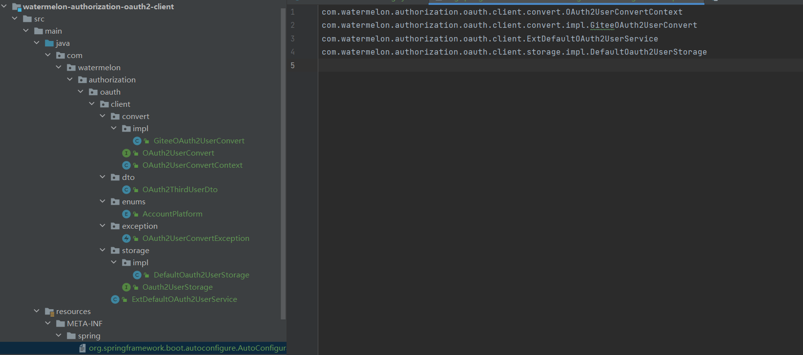
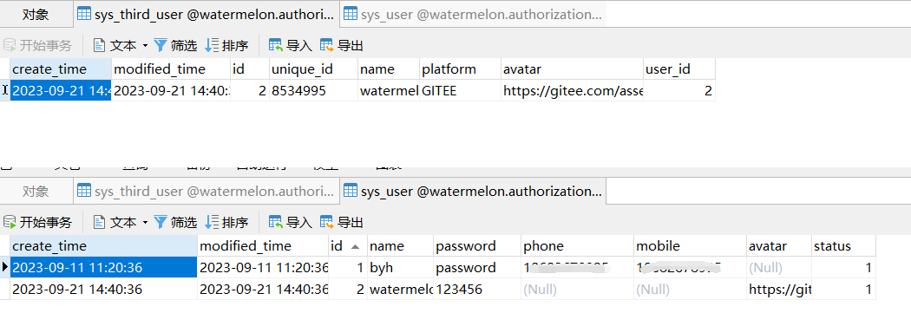

# 😄Spring Authorization Server (7) 第三方平台账号存储


### 寻找扩展点
以gitee 为例 ，gitee授权成功后的回调 `http://192.168.56.1:9000/login/oauth2/code/gitee` ，对应的就是 `OAuth2LoginAuthenticationFilter`处理。

#### OAuth2LoginAuthenticationFilter

````java
public class OAuth2LoginAuthenticationFilter extends AbstractAuthenticationProcessingFilter {

    public static final String DEFAULT_FILTER_PROCESSES_URI = "/login/oauth2/code/*";

    @Override
    public Authentication attemptAuthentication(HttpServletRequest request, HttpServletResponse response)
            throws AuthenticationException {
        //...省略

        OAuth2LoginAuthenticationToken authenticationResult = (OAuth2LoginAuthenticationToken) this
                .getAuthenticationManager().authenticate(authenticationRequest);
        //...省略
    }
}
````

其中 `OAuth2LoginAuthenticationToken authenticationResult = (OAuth2LoginAuthenticationToken) this .getAuthenticationManager().authenticate(authenticationRequest);`
跟源码继续往下，对应的就是 `OAuth2LoginAuthenticationProvider`.

#### OAuth2LoginAuthenticationProvider

````java
public class OAuth2LoginAuthenticationProvider implements AuthenticationProvider {

    private final OAuth2AuthorizationCodeAuthenticationProvider authorizationCodeAuthenticationProvider;

    private final OAuth2UserService<OAuth2UserRequest, OAuth2User> userService;

    @Override
    public Authentication authenticate(Authentication authentication) throws AuthenticationException {
        //...省略
        OAuth2User oauth2User = this.userService.loadUser(new OAuth2UserRequest(
                loginAuthenticationToken.getClientRegistration(), accessToken, additionalParameters));
        //...省略
    }
}
````

**this.userService.loadUser()** 继续跟到实现就是 `DefaultOAuth2UserService`

#### DefaultOAuth2UserService

````java
public class DefaultOAuth2UserService implements OAuth2UserService<OAuth2UserRequest, OAuth2User> {
    @Override
    public OAuth2User loadUser(OAuth2UserRequest userRequest) throws OAuth2AuthenticationException {
        //...省略
        
        //这个就是向gitee发起的请求了
        RequestEntity<?> request = this.requestEntityConverter.convert(userRequest);
        ResponseEntity<Map<String, Object>> response = getResponse(userRequest, request);
        Map<String, Object> userAttributes = response.getBody();
        Set<GrantedAuthority> authorities = new LinkedHashSet<>();
        authorities.add(new OAuth2UserAuthority(userAttributes));
        OAuth2AccessToken token = userRequest.getAccessToken();
        for (String authority : token.getScopes()) {
            authorities.add(new SimpleGrantedAuthority("SCOPE_" + authority));
        }
        //最后将gitee获取的用户信息 封装成一个 DefaultOAuth2User返回
        return new DefaultOAuth2User(authorities, userAttributes, userNameAttributeName);
    }
}
````
**DefaultOAuth2UserService**实际上时处理第三方平台的用户信息，那我们扩展 `DefaultOAuth2UserService`要将信息存到我们自己系统 是不是 在返回之后去做处理就行了呢，那可以直接继承`DefaultOAuth2UserService`去扩展

### 继承 DefaultOAuth2UserService 实现扩展

#### AccountPlatform 枚举
````java
public enum AccountPlatform {
    WX,
    QQ,
    GITEE,
    GITHUB;
}
````

#### OAuth2ThirdUserDto
统一第三方平台的用户信息实体，不用lombok的原因是因为想把此次扩展的定义为一个stater
````java
public class OAuth2ThirdUserDto implements Serializable {
    /**
     * 第三方平台唯一id
     */
    private String uniqueId;
    /**
     * 用户名称
     */
    private String name;
    /**
     * 平台类型(WX:微信；QQ:QQ)
     */
    private AccountPlatform platform;
    /**
     * 头像
     */
    private String avatar;


    public OAuth2ThirdUserDto(String uniqueId, String name, AccountPlatform platform, String avatar) {
        this.uniqueId = uniqueId;
        this.name = name;
        this.platform = platform;
        this.avatar = avatar;
    }


    public String getUniqueId() {
        return uniqueId;
    }

    public void setUniqueId(String uniqueId) {
        this.uniqueId = uniqueId;
    }

    public String getName() {
        return name;
    }

    public void setName(String name) {
        this.name = name;
    }

    public AccountPlatform getPlatform() {
        return platform;
    }

    public void setPlatform(AccountPlatform platform) {
        this.platform = platform;
    }

    public String getAvatar() {
        return avatar;
    }

    public void setAvatar(String avatar) {
        this.avatar = avatar;
    }

    @Override
    public boolean equals(Object o) {
        if (this == o) return true;
        if (o == null || getClass() != o.getClass()) return false;
        OAuth2ThirdUserDto that = (OAuth2ThirdUserDto) o;
        return Objects.equals(uniqueId, that.uniqueId) && Objects.equals(name, that.name) && platform == that.platform && Objects.equals(avatar, that.avatar);
    }

    @Override
    public int hashCode() {
        return Objects.hash(uniqueId, name, platform, avatar);
    }
}
````

#### OAuth2UserConvert
定义转换的接口，多个平台的情况下，采用一个策略模式
````java
//第三方用户转换接口定义
public interface OAuth2UserConvert {
    
    default AccountPlatform platform() {
        return null;
    }
    /**
     * 第三方用户信息统一转换为 OAuth2ThirdUserDto
     * @param oAuth2User
     * @param userNameAttributeName 额外的属性
     * @return
     */
    Pair<OAuth2ThirdUserDto, LinkedHashMap<String,Object>> convert(OAuth2User oAuth2User,String userNameAttributeName);
}
````
##### GiteeOAuth2UserConvert
gitee的OAuth2UserConvert实现
````java
public class GiteeOAuth2UserConvert implements OAuth2UserConvert {
    
    private final static String AVATAR_URL = "avatar_url";

    private final static String UNIQUE_ID = "id";

    private final static String NAME = "name";

    private final static String EMAIL = "email";

    private final static String PLATFORM = "platform";
    
    @Override
    public AccountPlatform platform() {
        return AccountPlatform.GITEE;
    }

    @Override
    public Pair<OAuth2ThirdUserDto, LinkedHashMap<String, Object>> convert(OAuth2User oAuth2User, String userNameAttributeName) {
        String avatarUrl = Optional.ofNullable(oAuth2User.getAttribute(AVATAR_URL)).map(Object::toString).orElse(null);
        String uniqueId = Optional.ofNullable(oAuth2User.getAttribute(UNIQUE_ID)).map(Object::toString).orElse(null);
        String name = Optional.ofNullable(oAuth2User.getAttribute(NAME)).map(Object::toString).orElse(null);
        String email = Optional.ofNullable(oAuth2User.getAttribute(EMAIL)).map(Object::toString).orElse(null);
        Object nameAttributeValue = Optional.ofNullable(userNameAttributeName).map(oAuth2User::getAttribute).orElse(null);

        LinkedHashMap<String, Object> userAttributesLinkedHashMap = new LinkedHashMap<>();
        //只需要部分字段就可以 不需要全部
        userAttributesLinkedHashMap.put(UNIQUE_ID, uniqueId);
        userAttributesLinkedHashMap.put(NAME, name);
        userAttributesLinkedHashMap.put(EMAIL, email);
        userAttributesLinkedHashMap.put(AVATAR_URL, avatarUrl);
        userAttributesLinkedHashMap.put(userNameAttributeName, nameAttributeValue);
        userAttributesLinkedHashMap.put(PLATFORM, this.platform().name());
        OAuth2ThirdUserDto oAuth2ThirdUserDto = new OAuth2ThirdUserDto(uniqueId, name, AccountPlatform.GITEE, avatarUrl);
        return new Pair<>(oAuth2ThirdUserDto, userAttributesLinkedHashMap);
    }
}

````

##### OAuth2UserConvertContext 
OAuth2UserConvert 的context 管理
````java
public class OAuth2UserConvertContext {

    private Map<AccountPlatform, OAuth2UserConvert> oAuth2UserConvertMap;
    /**
     * 加载 OAuth2UserConvert
     * @param oAuth2UserConvertList
     */
    public OAuth2UserConvertContext(List<OAuth2UserConvert> oAuth2UserConvertList) {
        this.oAuth2UserConvertMap = oAuth2UserConvertList.stream().collect(Collectors.toMap(OAuth2UserConvert::platform, Function.identity()));

    }
    /**
     * 获取实例
     * @param platform
     * @return
     */
    public OAuth2UserConvert getInstance(AccountPlatform platform) {
        if (platform == null) {
            throw new SystemException("平台类型不能为空");
        }
        OAuth2UserConvert oAuth2UserConvert = oAuth2UserConvertMap.get(platform);
        if (oAuth2UserConvert == null) {
            throw new SystemException("暂不支持[" + platform + "]平台类型");
        }
        return oAuth2UserConvert;
    }
}
````

#### Oauth2UserStorage
````java
//第三方平台保存接口定义
public interface Oauth2UserStorage {

    /**
     * 保存
     * @param auth2ThirdUserDto
     */
    void save(OAuth2ThirdUserDto auth2ThirdUserDto);

}
````

##### DefaultOauth2UserStorage 
用户信息保存默认实现 ，是因为`ExtDefaultOAuth2UserService`中引入了`Oauth2UserStorage` 构造方法中 `Oauth2UserStorage`没有实例无法完成实例化，然后引入了这个stater的实现这个接口完善自己的逻辑即可。
````java
public class DefaultOauth2UserStorage implements Oauth2UserStorage {
    @Override
    public void save(OAuth2ThirdUserDto auth2ThirdUserDto) {

    }
}
````

#### ExtDefaultOAuth2UserService

````java
public class ExtDefaultOAuth2UserService extends DefaultOAuth2UserService {

    public final OAuth2UserConvertContext oAuth2UserConvertContext;

    public final Oauth2UserStorage oauth2UserStorage;

    public ExtDefaultOAuth2UserService(OAuth2UserConvertContext oAuth2UserConvertContext, Oauth2UserStorage oauth2UserStorage) {
        this.oAuth2UserConvertContext = oAuth2UserConvertContext;
        this.oauth2UserStorage = oauth2UserStorage;
    }
    
    @Override
    public OAuth2User loadUser(OAuth2UserRequest userRequest) throws OAuth2AuthenticationException {
        OAuth2User oAuth2User = super.loadUser(userRequest);
        String userNameAttributeName = userRequest.getClientRegistration().getProviderDetails().getUserInfoEndpoint()
                .getUserNameAttributeName();
        AccountPlatform platform = this.loginPlatformConvert(userRequest.getClientRegistration().getRegistrationId());
        //将 OAuth2User 根据不同的平台 转成统一的 第三方用户了
        Pair<OAuth2ThirdUserDto, LinkedHashMap<String, Object>> oAuth2ThirdUserConvertPair = oAuth2UserConvertContext.getInstance(platform)
                .convert(oAuth2User, userNameAttributeName);
        LinkedHashMap<String, Object> userAttributes = oAuth2ThirdUserConvertPair.getValue();
        //这个地方保存逻辑了
        oauth2UserStorage.save(oAuth2ThirdUserConvertPair.getKey());
        return new DefaultOAuth2User(oAuth2User.getAuthorities(), userAttributes, userNameAttributeName);
    }

    /**
     * registrationId 转换平台枚举
     * @param registrationId
     * @return
     */
    synchronized private AccountPlatform loginPlatformConvert(String registrationId) {
        return switch (registrationId) {
            case "gitee" -> AccountPlatform.GITEE;
            case "wechat" -> AccountPlatform.WECHAT;//todo Convert
            case "qq" -> AccountPlatform.QQ;//todo Convert
            default -> throw new OAuth2UserConvertException("暂不支持该客户端[" + registrationId + "]对应的第三方平台用户信息Convert");
        };
    }
}
````
**watermelon-authorization-oauth2-client** stater就完成了


**watermelon-authorization-server** 引入依赖


#### 实现Oauth2UserStorage接口

````java
@Primary
@Service("mybatisOauth2UserStorage")
@RequiredArgsConstructor
public class MybatisOauth2UserStorage implements Oauth2UserStorage {

    private final SysThirdUserService sysThirdUserService;

    private final SysUserService sysUserService;

    @Override
    public void save(OAuth2ThirdUserDto auth2ThirdUserDto) {
        SysUseAddDto sysUseAddDto = new SysUseAddDto();
        sysUseAddDto.setName(auth2ThirdUserDto.getName());
        sysUseAddDto.setAvatar(auth2ThirdUserDto.getAvatar());
        sysUseAddDto.setStatus(1);
        Long sysUserId = sysUserService.save(sysUseAddDto);
        SysThirdUserAddDto sysThirdUserAddDto = new SysThirdUserAddDto();
        sysThirdUserAddDto.setUniqueId(auth2ThirdUserDto.getUniqueId());
        sysThirdUserAddDto.setAvatar(auth2ThirdUserDto.getAvatar());
        sysThirdUserAddDto.setPlatform(auth2ThirdUserDto.getPlatform());
        sysThirdUserAddDto.setName(auth2ThirdUserDto.getName());
        sysThirdUserAddDto.setUserId(sysUserId);
        sysThirdUserService.save(sysThirdUserAddDto);
    }
}

````

最后保存成功了



完整的代码：https://github.com/WatermelonPlanet/watermelon-cloud