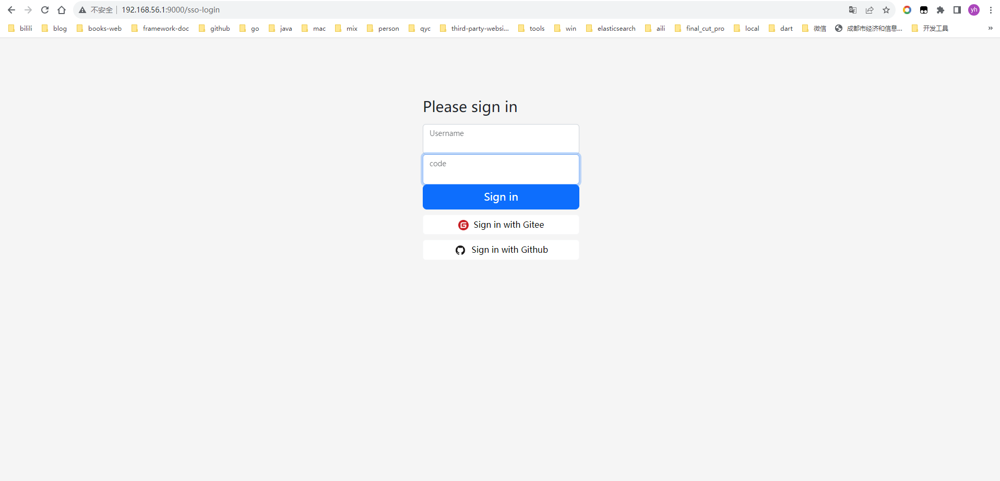
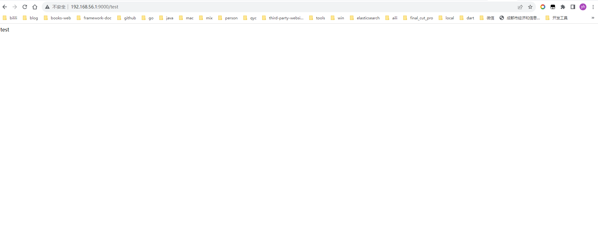

# 🔥Spring Authorization Server (8) 授权服务默认登录-扩展（手机号+验证码）


## 扩展-默认登录

看看 AbstractAuthenticationProcessingFilter 怎么玩 我们就怎么玩

### 自定义 抽象 filter  UserAuthenticationProcessingFilter 

````java
public abstract class UserAuthenticationProcessingFilter extends GenericFilterBean
		implements ApplicationEventPublisherAware, MessageSourceAware {

	private SecurityContextHolderStrategy securityContextHolderStrategy = SecurityContextHolder
			.getContextHolderStrategy();

	protected ApplicationEventPublisher eventPublisher;

	protected AuthenticationDetailsSource<HttpServletRequest, ?> authenticationDetailsSource = new WebAuthenticationDetailsSource();

	private AuthenticationManager authenticationManager;

	protected MessageSourceAccessor messages = SpringSecurityMessageSource.getAccessor();

	private RememberMeServices rememberMeServices = new NullRememberMeServices();

	private RequestMatcher requiresAuthenticationRequestMatcher;

	private boolean continueChainBeforeSuccessfulAuthentication = false;

	private SessionAuthenticationStrategy sessionStrategy = new NullAuthenticatedSessionStrategy();

	private boolean allowSessionCreation = true;

	private AuthenticationSuccessHandler successHandler = new SavedRequestAwareAuthenticationSuccessHandler();

	private AuthenticationFailureHandler failureHandler = new SimpleUrlAuthenticationFailureHandler();

	private SecurityContextRepository securityContextRepository = new RequestAttributeSecurityContextRepository();


	protected UserAuthenticationProcessingFilter(String defaultFilterProcessesUrl) {
		setFilterProcessesUrl(defaultFilterProcessesUrl);
	}


	protected UserAuthenticationProcessingFilter(RequestMatcher requiresAuthenticationRequestMatcher) {
		Assert.notNull(requiresAuthenticationRequestMatcher, "requiresAuthenticationRequestMatcher cannot be null");
		this.requiresAuthenticationRequestMatcher = requiresAuthenticationRequestMatcher;
	}

	
	protected UserAuthenticationProcessingFilter(String defaultFilterProcessesUrl,
                                                 AuthenticationManager authenticationManager) {
		setFilterProcessesUrl(defaultFilterProcessesUrl);
		setAuthenticationManager(authenticationManager);
	}

	
	protected UserAuthenticationProcessingFilter(RequestMatcher requiresAuthenticationRequestMatcher,
                                                 AuthenticationManager authenticationManager) {
		setRequiresAuthenticationRequestMatcher(requiresAuthenticationRequestMatcher);
		setAuthenticationManager(authenticationManager);
	}

	@Override
	public void afterPropertiesSet() {
		Assert.notNull(this.authenticationManager, "authenticationManager must be specified");
	}


	@Override
	public void doFilter(ServletRequest request, ServletResponse response, FilterChain chain)
			throws IOException, ServletException {
		doFilter((HttpServletRequest) request, (HttpServletResponse) response, chain);
	}

	private void doFilter(HttpServletRequest request, HttpServletResponse response, FilterChain chain)
			throws IOException, ServletException {
		if (!requiresAuthentication(request, response)) {
			chain.doFilter(request, response);
			return;
		}
		try {
			Authentication authenticationResult = attemptAuthentication(request, response);
			if (authenticationResult == null) {
				// return immediately as subclass has indicated that it hasn't completed
				return;
			}
			this.sessionStrategy.onAuthentication(authenticationResult, request, response);
			// Authentication success
			if (this.continueChainBeforeSuccessfulAuthentication) {
				chain.doFilter(request, response);
			}
			successfulAuthentication(request, response, chain, authenticationResult);
		}
		catch (InternalAuthenticationServiceException failed) {
			this.logger.error("An internal error occurred while trying to authenticate the user.", failed);
			unsuccessfulAuthentication(request, response, failed);
		}
		catch (AuthenticationException ex) {
			// Authentication failed
			unsuccessfulAuthentication(request, response, ex);
		}
	}


	protected boolean requiresAuthentication(HttpServletRequest request, HttpServletResponse response) {
		if (this.requiresAuthenticationRequestMatcher.matches(request)) {
			return true;
		}
		if (this.logger.isTraceEnabled()) {
			this.logger
					.trace(LogMessage.format("Did not match request to %s", this.requiresAuthenticationRequestMatcher));
		}
		return false;
	}


	public abstract Authentication attemptAuthentication(HttpServletRequest request, HttpServletResponse response)
			throws AuthenticationException, IOException, ServletException;


	protected void successfulAuthentication(HttpServletRequest request, HttpServletResponse response, FilterChain chain,
			Authentication authResult) throws IOException, ServletException {
		SecurityContext context = this.securityContextHolderStrategy.createEmptyContext();
		context.setAuthentication(authResult);
		this.securityContextHolderStrategy.setContext(context);
		this.securityContextRepository.saveContext(context, request, response);
		if (this.logger.isDebugEnabled()) {
			this.logger.debug(LogMessage.format("Set SecurityContextHolder to %s", authResult));
		}
		this.rememberMeServices.loginSuccess(request, response, authResult);
		if (this.eventPublisher != null) {
			this.eventPublisher.publishEvent(new InteractiveAuthenticationSuccessEvent(authResult, this.getClass()));
		}
		this.successHandler.onAuthenticationSuccess(request, response, authResult);
	}


	protected void unsuccessfulAuthentication(HttpServletRequest request, HttpServletResponse response,
			AuthenticationException failed) throws IOException, ServletException {
		this.securityContextHolderStrategy.clearContext();
		this.logger.trace("Failed to process authentication request", failed);
		this.logger.trace("Cleared SecurityContextHolder");
		this.logger.trace("Handling authentication failure");
		this.rememberMeServices.loginFail(request, response);
		this.failureHandler.onAuthenticationFailure(request, response, failed);
	}

	protected AuthenticationManager getAuthenticationManager() {
		return this.authenticationManager;
	}

	public void setAuthenticationManager(AuthenticationManager authenticationManager) {
		this.authenticationManager = authenticationManager;
	}


	public void setFilterProcessesUrl(String filterProcessesUrl) {
		setRequiresAuthenticationRequestMatcher(new AntPathRequestMatcher(filterProcessesUrl));
	}

	public final void setRequiresAuthenticationRequestMatcher(RequestMatcher requestMatcher) {
		Assert.notNull(requestMatcher, "requestMatcher cannot be null");
		this.requiresAuthenticationRequestMatcher = requestMatcher;
	}

	public RememberMeServices getRememberMeServices() {
		return this.rememberMeServices;
	}

	public void setRememberMeServices(RememberMeServices rememberMeServices) {
		Assert.notNull(rememberMeServices, "rememberMeServices cannot be null");
		this.rememberMeServices = rememberMeServices;
	}


	public void setContinueChainBeforeSuccessfulAuthentication(boolean continueChainBeforeSuccessfulAuthentication) {
		this.continueChainBeforeSuccessfulAuthentication = continueChainBeforeSuccessfulAuthentication;
	}

	@Override
	public void setApplicationEventPublisher(ApplicationEventPublisher eventPublisher) {
		this.eventPublisher = eventPublisher;
	}

	public void setAuthenticationDetailsSource(
			AuthenticationDetailsSource<HttpServletRequest, ?> authenticationDetailsSource) {
		Assert.notNull(authenticationDetailsSource, "AuthenticationDetailsSource required");
		this.authenticationDetailsSource = authenticationDetailsSource;
	}

	@Override
	public void setMessageSource(MessageSource messageSource) {
		this.messages = new MessageSourceAccessor(messageSource);
	}

	protected boolean getAllowSessionCreation() {
		return this.allowSessionCreation;
	}

	public void setAllowSessionCreation(boolean allowSessionCreation) {
		this.allowSessionCreation = allowSessionCreation;
	}


	public void setSessionAuthenticationStrategy(SessionAuthenticationStrategy sessionStrategy) {
		this.sessionStrategy = sessionStrategy;
	}


	public void setAuthenticationSuccessHandler(AuthenticationSuccessHandler successHandler) {
		Assert.notNull(successHandler, "successHandler cannot be null");
		this.successHandler = successHandler;
	}

	public void setAuthenticationFailureHandler(AuthenticationFailureHandler failureHandler) {
		Assert.notNull(failureHandler, "failureHandler cannot be null");
		this.failureHandler = failureHandler;
	}


	public void setSecurityContextRepository(SecurityContextRepository securityContextRepository) {
		Assert.notNull(securityContextRepository, "securityContextRepository cannot be null");
		this.securityContextRepository = securityContextRepository;
	}


	public void setSecurityContextHolderStrategy(SecurityContextHolderStrategy securityContextHolderStrategy) {
		Assert.notNull(securityContextHolderStrategy, "securityContextHolderStrategy cannot be null");
		this.securityContextHolderStrategy = securityContextHolderStrategy;
	}

	protected AuthenticationSuccessHandler getSuccessHandler() {
		return this.successHandler;
	}

	protected AuthenticationFailureHandler getFailureHandler() {
		return this.failureHandler;
	}

}

````
### 实现 UserAuthenticationProcessingFilter 抽象类
````java
public class UserAuthenticationFilter extends UserAuthenticationProcessingFilter {

	public static final String SPRING_SECURITY_FORM_USERNAME_KEY = "username";

	public static final String SPRING_SECURITY_FORM_PASSWORD_KEY = "password";

	public static final String SPRING_SECURITY_FORM_CODE_KEY = "code";

	private  String usernameParameter = SPRING_SECURITY_FORM_USERNAME_KEY;

	private String passwordParameter = SPRING_SECURITY_FORM_PASSWORD_KEY;

	private final String codeParameter = SPRING_SECURITY_FORM_CODE_KEY;

	private boolean postOnly = true;

	private static final AntPathRequestMatcher DEFAULT_ANT_PATH_REQUEST_MATCHER = new AntPathRequestMatcher("/sso-login",
			"POST");

	public UserAuthenticationFilter() {
		super(DEFAULT_ANT_PATH_REQUEST_MATCHER);
	}

	public UserAuthenticationFilter(AuthenticationManager authenticationManager) {
		super(DEFAULT_ANT_PATH_REQUEST_MATCHER, authenticationManager);
	}

	
	@Override
	public Authentication attemptAuthentication(HttpServletRequest request, HttpServletResponse response)
			throws AuthenticationException {
		if (this.postOnly && !request.getMethod().equals("POST")) {
			throw new AuthenticationServiceException("Authentication method not supported: " + request.getMethod());
		}
		String username = obtainUsername(request);
		username = (username != null) ? username.trim() : "";
		String password = obtainPassword(request);
		if(StringUtils.hasText(password)){
			password = (password != null) ? password : "";
			UsernamePasswordAuthenticationToken authRequest = UsernamePasswordAuthenticationToken.unauthenticated(username,
					password);
			// Allow subclasses to set the "details" property
			setDetails(request, authRequest);
			return this.getAuthenticationManager().authenticate(authRequest);
		}else {
			String code = obtainCode(request);
			assert code != null;
			if (!code.equals("000000")) {
				throw new UsernameNotFoundException("验证码错误！");
			}
			PhoneCaptchaAuthenticationToken authRequest = PhoneCaptchaAuthenticationToken.unauthenticated(username, code);
			// Allow subclasses to set the "details" property
			this.setDetails(request, authRequest);
			return this.getAuthenticationManager().authenticate(authRequest);
		}

	}


	@Nullable
	protected String obtainPassword(HttpServletRequest request) {
		return request.getParameter(this.passwordParameter);
	}


	@Nullable
	protected String obtainUsername(HttpServletRequest request) {
		return request.getParameter(this.usernameParameter);
	}


	@Nullable
	protected String obtainCode(HttpServletRequest request) {
		return request.getParameter(this.codeParameter);
	}


	protected void setDetails(HttpServletRequest request, UsernamePasswordAuthenticationToken authRequest) {
		authRequest.setDetails(this.authenticationDetailsSource.buildDetails(request));
	}

	protected void setDetails(HttpServletRequest request, PhoneCaptchaAuthenticationToken authRequest) {
		authRequest.setDetails(this.authenticationDetailsSource.buildDetails(request));
	}

	
	public void setPasswordParameter(String passwordParameter) {
		this.passwordParameter = passwordParameter;
	}
	
	public void setPostOnly(boolean postOnly) {
		this.postOnly = postOnly;
	}

	
	public final String getUsernameParameter() {
		return this.usernameParameter;
	}
	
}
````

### PhoneCaptchaAuthenticationToken 实现 AuthenticationToken 
````java
public class PhoneCaptchaAuthenticationToken extends AbstractAuthenticationToken {

    private final Object principal;

    private Object credentials;

    public PhoneCaptchaAuthenticationToken(Object principal, Object credentials) {
        super(null);
        this.principal = principal;
        this.credentials = credentials;
        setAuthenticated(false);
    }


    public PhoneCaptchaAuthenticationToken(Object principal, Object credentials,
                                               Collection<? extends GrantedAuthority> authorities) {
        super(authorities);
        this.principal = principal;
        this.credentials = credentials;
        super.setAuthenticated(true); // must use super, as we override
    }


    public static PhoneCaptchaAuthenticationToken unauthenticated(Object principal, Object credential) {
        return new PhoneCaptchaAuthenticationToken(principal, credential);
    }


    public static PhoneCaptchaAuthenticationToken authenticated(Object principal, Object credentials,
                                                                    Collection<? extends GrantedAuthority> authorities) {
        return new PhoneCaptchaAuthenticationToken(principal, credentials, authorities);
    }

    @Override
    public Object getCredentials() {
        return this.credentials;
    }

    @Override
    public Object getPrincipal() {
        return this.principal;
    }

    @Override
    public void setAuthenticated(boolean isAuthenticated) throws IllegalArgumentException {
        Assert.isTrue(!isAuthenticated,
                "Cannot set this token to trusted - use constructor which takes a GrantedAuthority list instead");
        super.setAuthenticated(false);
    }

    @Override
    public void eraseCredentials() {
        super.eraseCredentials();
        this.credentials = null;
    }
}

````

### `PhoneCaptchaAuthenticationProvider`实现 AuthenticationProvider
````java
@Component
public class PhoneCaptchaAuthenticationProvider
		implements AuthenticationProvider {

	protected final Log logger = LogFactory.getLog(getClass());

	protected MessageSourceAccessor messages = SpringSecurityMessageSource.getAccessor();

	private UserCache userCache = new NullUserCache();

	private final boolean forcePrincipalAsString = false;

	protected boolean hideUserNotFoundExceptions = true;

	private UserDetailsChecker preAuthenticationChecks = new DefaultPreAuthenticationChecks();

	private UserDetailsChecker postAuthenticationChecks = new DefaultPostAuthenticationChecks();

	private GrantedAuthoritiesMapper authoritiesMapper = new NullAuthoritiesMapper();

	@Lazy
	@Autowired
	public UserDetailsService userDetailsService;


	@Override
	public Authentication authenticate(Authentication authentication) throws AuthenticationException {
		Assert.isInstanceOf(PhoneCaptchaAuthenticationToken.class, authentication,
				() -> this.messages.getMessage("PhoneCaptchaAuthenticationProvider.onlySupports",
						"Only PhoneCaptchaAuthenticationToken is supported"));
		String username = determineUsername(authentication);
		boolean cacheWasUsed = true;
		UserDetails user = this.userCache.getUserFromCache(username);
		if (user == null) {
			cacheWasUsed = false;
			try {
				user = retrieveUser(username, (PhoneCaptchaAuthenticationToken) authentication);
			}
			catch (UsernameNotFoundException ex) {
				this.logger.debug("Failed to find phone '" + username + "'");
				if (!this.hideUserNotFoundExceptions) {
					throw ex;
				}
				throw new BadCredentialsException(this.messages
						.getMessage("PhoneCaptchaAuthenticationProvider.badCredentials", "Bad credentials"));
			}
			Assert.notNull(user, "retrieveUser returned null - a violation of the interface contract");
		}
		try {
			this.preAuthenticationChecks.check(user);
		}
		catch (AuthenticationException ex) {
			if (!cacheWasUsed) {
				throw ex;
			}
			// There was a problem, so try again after checking
			// we're using latest data (i.e. not from the cache)
			cacheWasUsed = false;
			user = retrieveUser(username, (PhoneCaptchaAuthenticationToken) authentication);
			this.preAuthenticationChecks.check(user);
		}
		this.postAuthenticationChecks.check(user);
		if (!cacheWasUsed) {
			this.userCache.putUserInCache(user);
		}
		Object principalToReturn = user;
		if (this.forcePrincipalAsString) {
			principalToReturn = user.getUsername();
		}
		Authentication successAuthentication = createSuccessAuthentication(principalToReturn, authentication, user);
		return successAuthentication;
	}

	private String determineUsername(Authentication authentication) {
		return (authentication.getPrincipal() == null) ? "NONE_PROVIDED" : authentication.getName();
	}


	protected Authentication createSuccessAuthentication(Object principal, Authentication authentication,
			UserDetails user) {
		PhoneCaptchaAuthenticationToken result = PhoneCaptchaAuthenticationToken.authenticated(principal,
				authentication.getCredentials(), this.authoritiesMapper.mapAuthorities(user.getAuthorities()));
		result.setDetails(authentication.getDetails());
		this.logger.debug("Authenticated user");
		return result;
	}


	public UserCache getUserCache() {
		return this.userCache;
	}

	public boolean isForcePrincipalAsString() {
		return this.forcePrincipalAsString;
	}

	public boolean isHideUserNotFoundExceptions() {
		return this.hideUserNotFoundExceptions;
	}


	protected  UserDetails retrieveUser(String username, PhoneCaptchaAuthenticationToken authentication)
			throws AuthenticationException{
		try {
			UserDetails loadedUser = this.getUserDetailsService().loadUserByUsername(username);
			if (loadedUser == null) {
				throw new InternalAuthenticationServiceException(
						"UserDetailsService returned null, which is an interface contract violation");
			}
			return loadedUser;
		}
		catch (UsernameNotFoundException ex) {
			throw ex;
		}
		catch (InternalAuthenticationServiceException ex) {
			throw ex;
		}
		catch (Exception ex) {
			throw new InternalAuthenticationServiceException(ex.getMessage(), ex);
		}

	}


	protected UserDetailsService getUserDetailsService() {
		return this.userDetailsService;
	}


	public void setUserCache(UserCache userCache) {
		this.userCache = userCache;
	}

	@Override
	public boolean supports(Class<?> authentication) {
		return (PhoneCaptchaAuthenticationToken.class.isAssignableFrom(authentication));
	}

	protected UserDetailsChecker getPreAuthenticationChecks() {
		return this.preAuthenticationChecks;
	}

	/**
	 * Sets the policy will be used to verify the status of the loaded
	 * <tt>UserDetails</tt> <em>before</em> validation of the credentials takes place.
	 * @param preAuthenticationChecks strategy to be invoked prior to authentication.
	 */
	public void setPreAuthenticationChecks(UserDetailsChecker preAuthenticationChecks) {
		this.preAuthenticationChecks = preAuthenticationChecks;
	}

	protected UserDetailsChecker getPostAuthenticationChecks() {
		return this.postAuthenticationChecks;
	}

	public void setPostAuthenticationChecks(UserDetailsChecker postAuthenticationChecks) {
		this.postAuthenticationChecks = postAuthenticationChecks;
	}

	public void setAuthoritiesMapper(GrantedAuthoritiesMapper authoritiesMapper) {
		this.authoritiesMapper = authoritiesMapper;
	}


	private class DefaultPreAuthenticationChecks implements UserDetailsChecker {

		@Override
		public void check(UserDetails user) {
			if (!user.isAccountNonLocked()) {
				PhoneCaptchaAuthenticationProvider.this.logger
						.debug("Failed to authenticate since user account is locked");
				throw new LockedException(PhoneCaptchaAuthenticationProvider.this.messages
						.getMessage("AbstractUserDetailsAuthenticationProvider.locked", "User account is locked"));
			}
			if (!user.isEnabled()) {
				PhoneCaptchaAuthenticationProvider.this.logger
						.debug("Failed to authenticate since user account is disabled");
				throw new DisabledException(PhoneCaptchaAuthenticationProvider.this.messages
						.getMessage("AbstractUserDetailsAuthenticationProvider.disabled", "User is disabled"));
			}
			if (!user.isAccountNonExpired()) {
				PhoneCaptchaAuthenticationProvider.this.logger
						.debug("Failed to authenticate since user account has expired");
				throw new AccountExpiredException(PhoneCaptchaAuthenticationProvider.this.messages
						.getMessage("AbstractUserDetailsAuthenticationProvider.expired", "User account has expired"));
			}
		}

	}

	private class DefaultPostAuthenticationChecks implements UserDetailsChecker {

		@Override
		public void check(UserDetails user) {
			if (!user.isCredentialsNonExpired()) {
				logger.debug("Failed to authenticate since user account credentials have expired");
				throw new CredentialsExpiredException(PhoneCaptchaAuthenticationProvider.this.messages
						.getMessage("PhoneCaptchaAuthenticationProvider.credentialsExpired",
								"User credentials have expired"));
			}
		}

	}

}

````

### 
`````java
@EnableWebSecurity
@Configuration(proxyBeanMethods = false)
public class DefaultSecurityConfig {


    @Autowired
    private PhoneCaptchaAuthenticationProvider phoneCaptchaAuthenticationProvider;


    // 过滤器链
    @Bean
    public SecurityFilterChain defaultSecurityFilterChain(HttpSecurity http) throws Exception {
        UserAuthenticationFilter userAuthenticationFilter = new UserAuthenticationFilter();
        http
                .addFilterAt(userAuthenticationFilter, UsernamePasswordAuthenticationFilter.class)
                .authorizeHttpRequests(authorize ->//① 配置鉴权的
                        authorize
                                .requestMatchers(
                                        "/assets/**",
                                        "/webjars/**",
                                        "/sso-login",
                                        "/oauth2/**",
                                        "/oauth2/token"
                                ).permitAll() //② 忽略鉴权的url
                                .anyRequest().authenticated()//③ 排除忽略的其他url就需要鉴权了
                )
                .csrf(AbstractHttpConfigurer::disable)
                .authenticationProvider(phoneCaptchaAuthenticationProvider)
                .formLogin(login ->
                        login.loginPage("/sso-login")
                                .defaultSuccessUrl("/test") // 登录成功后的跳转路径
                )
                .oauth2Login(oauth2Login ->
                        oauth2Login.loginPage("/sso-login")
                );

        DefaultSecurityFilterChain build = http.build();
        // 需要要在 http.build 后中的 才能获取到 以下的几个class
        userAuthenticationFilter.setAuthenticationManager(http.getSharedObject(AuthenticationManager.class));
        userAuthenticationFilter.setSessionAuthenticationStrategy(http.getSharedObject(SessionAuthenticationStrategy.class));
        SecurityContextRepository securityContextRepository = new DelegatingSecurityContextRepository(
                new RequestAttributeSecurityContextRepository(), new HttpSessionSecurityContextRepository());
        userAuthenticationFilter.setSecurityContextRepository(securityContextRepository);

        return build;
    }
}
`````

### sso-login.html
````html
<!DOCTYPE html>
<html lang="en" xmlns="http://www.w3.org/1999/xhtml" xmlns:th="https://www.thymeleaf.org">
<head>
    <meta charset="utf-8" />
    <meta name="viewport" content="width=device-width, initial-scale=1">
    <title>Spring Authorization Server sample</title>
    <link rel="stylesheet" href="/webjars/bootstrap/css/bootstrap.css" th:href="@{/webjars/bootstrap/css/bootstrap.css}" />
    <link rel="stylesheet" href="/assets/css/signin.css" th:href="@{/assets/css/signin.css}" />
</head>
<body>
<div class="container">
    <form class="form-signin w-100 m-auto" method="post" th:action="@{/sso-login}">
        <div th:if="${param.error}" class="alert alert-danger" role="alert">
            Invalid username or password.
        </div>
        <div th:if="${param.logout}" class="alert alert-success" role="alert">
            You have been logged out.
        </div>
        <h1 class="h3 mb-3 fw-normal">Please sign in</h1>
        <div class="form-floating">
            <input type="text" id="username" name="username" class="form-control" required autofocus>
            <label for="username">Username</label>
        </div>
        <div class="form-floating">
            <input type="text" id="code" name="code" class="form-control" required>
            <label for="code">code</label>
        </div>
        <div>
            <button class="w-100 btn btn-lg btn-primary btn-block" type="submit">Sign in</button>
            <a class="w-100 btn btn-light btn-block bg-white" href="/oauth2/authorization/gitee" role="link" style="margin-top: 10px">
                
                Sign in with Gitee
            </a>
            <a class="w-100 btn btn-light btn-block bg-white" href="/oauth2/authorization/github-idp" role="link" style="margin-top: 10px">
                
                Sign in with Github
            </a>
        </div>
    </form>
</div>
</body>
</html>
````




到这已经完全结束了


下面讲讲为什么这样去写扩展


## 默认登录的核心类

###默认认证的过滤器配置
````java
@EnableWebSecurity
@Configuration(proxyBeanMethods = false)
public class DefaultSecurityConfig {
    
    // 过滤器链
    @Bean
    public SecurityFilterChain defaultSecurityFilterChain(HttpSecurity http) throws Exception {
        http
                .authorizeHttpRequests(authorize ->//① 配置鉴权的
                        authorize
                                .requestMatchers(
                                        "/assets/**",
                                        "/webjars/**",
                                        AuthorizationServerConfigurationConsent.LOGIN_PAGE_URL,
                                        "/oauth2/**",
                                        "/oauth2/token"
                                ).permitAll() //② 忽略鉴权的url
                                .anyRequest().authenticated()//③ 排除忽略的其他url就需要鉴权了
                )
                .csrf(AbstractHttpConfigurer::disable)
                .formLogin(login ->
                        login.loginPage(AuthorizationServerConfigurationConsent.LOGIN_PAGE_URL)
                                .defaultSuccessUrl("/test") // 登录成功后的跳转路径
                )
                .oauth2Login(oauth2Login ->
                        oauth2Login.loginPage(AuthorizationServerConfigurationConsent.LOGIN_PAGE_URL)
                );

        return http.build();
    }
}
````

###授权服务默认登录
#### UsernamePasswordAuthenticationFilter
默认登录url`/login`，能找到对应的filter`UsernamePasswordAuthenticationFilter`，需要从这个地方先入手，点进去看看
````java
public class UsernamePasswordAuthenticationFilter extends AbstractAuthenticationProcessingFilter {

    public static final String SPRING_SECURITY_FORM_USERNAME_KEY = "username";

    public static final String SPRING_SECURITY_FORM_PASSWORD_KEY = "password";

    private static final AntPathRequestMatcher DEFAULT_ANT_PATH_REQUEST_MATCHER = new AntPathRequestMatcher("/login",
            "POST");

    private String usernameParameter = SPRING_SECURITY_FORM_USERNAME_KEY;

    private String passwordParameter = SPRING_SECURITY_FORM_PASSWORD_KEY;

    private boolean postOnly = true;

    public UsernamePasswordAuthenticationFilter() {
        super(DEFAULT_ANT_PATH_REQUEST_MATCHER);
    }

    public UsernamePasswordAuthenticationFilter(AuthenticationManager authenticationManager) {
        super(DEFAULT_ANT_PATH_REQUEST_MATCHER, authenticationManager);
    }

    @Override
    public Authentication attemptAuthentication(HttpServletRequest request, HttpServletResponse response)
            throws AuthenticationException {
        if (this.postOnly && !request.getMethod().equals("POST")) {
            throw new AuthenticationServiceException("Authentication method not supported: " + request.getMethod());
        }
        String username = obtainUsername(request);
        username = (username != null) ? username.trim() : "";
        String password = obtainPassword(request);
        password = (password != null) ? password : "";
        UsernamePasswordAuthenticationToken authRequest = UsernamePasswordAuthenticationToken.unauthenticated(username,
                password);
        // Allow subclasses to set the "details" property
        setDetails(request, authRequest);
        return this.getAuthenticationManager().authenticate(authRequest);
    }
}
````

`UsernamePasswordAuthenticationFilter` 继承 `AbstractAuthenticationProcessingFilter`的 重写了 `attemptAuthentication()`方法，`this.getAuthenticationManager().authenticate(authRequest);` 最后返回了`Authentication`。

#### AbstractAuthenticationProcessingFilter

````java
public abstract class AbstractAuthenticationProcessingFilter extends GenericFilterBean
        implements ApplicationEventPublisherAware, MessageSourceAware {

   
    // UsernamePasswordAuthenticationFilter 是 对应就是  CompositeSessionAuthenticationStrategy 因为 AbstractAuthenticationFilterConfigurer.config() 初始化了
    private SessionAuthenticationStrategy sessionStrategy = new NullAuthenticatedSessionStrategy();

    //
    private SecurityContextRepository securityContextRepository = new RequestAttributeSecurityContextRepository();

    
    public abstract Authentication attemptAuthentication(HttpServletRequest request, HttpServletResponse response)
            throws AuthenticationException, IOException, ServletException;
    
    
    private void doFilter(HttpServletRequest request, HttpServletResponse response, FilterChain chain)
            throws IOException, ServletException {
        if (!requiresAuthentication(request, response)) {
            chain.doFilter(request, response);
            return;
        }
        try {
            Authentication authenticationResult = attemptAuthentication(request, response);
            if (authenticationResult == null) {
                // return immediately as subclass has indicated that it hasn't completed
                return;
            }
            this.sessionStrategy.onAuthentication(authenticationResult, request, response);
            // Authentication success
            if (this.continueChainBeforeSuccessfulAuthentication) {
                chain.doFilter(request, response);
            }
            successfulAuthentication(request, response, chain, authenticationResult);
        } catch (InternalAuthenticationServiceException failed) {
            this.logger.error("An internal error occurred while trying to authenticate the user.", failed);
            unsuccessfulAuthentication(request, response, failed);
        } catch (AuthenticationException ex) {
            // Authentication failed
            unsuccessfulAuthentication(request, response, ex);
        }
    }
}

````

#### AbstractAuthenticationFilterConfigurer
````java
public abstract class AbstractAuthenticationFilterConfigurer<B extends HttpSecurityBuilder<B>, T extends AbstractAuthenticationFilterConfigurer<B, T, F>, F extends AbstractAuthenticationProcessingFilter>
        extends AbstractHttpConfigurer<T, B> {
    @Override
    public void configure(B http) throws Exception {
        PortMapper portMapper = http.getSharedObject(PortMapper.class);
        if (portMapper != null) {
            this.authenticationEntryPoint.setPortMapper(portMapper);
        }
        RequestCache requestCache = http.getSharedObject(RequestCache.class);
        if (requestCache != null) {
            this.defaultSuccessHandler.setRequestCache(requestCache);
        }
        this.authFilter.setAuthenticationManager(http.getSharedObject(AuthenticationManager.class));
        this.authFilter.setAuthenticationSuccessHandler(this.successHandler);
        this.authFilter.setAuthenticationFailureHandler(this.failureHandler);
        if (this.authenticationDetailsSource != null) {
            this.authFilter.setAuthenticationDetailsSource(this.authenticationDetailsSource);
        }
        SessionAuthenticationStrategy sessionAuthenticationStrategy = http
                .getSharedObject(SessionAuthenticationStrategy.class);
        if (sessionAuthenticationStrategy != null) {
            this.authFilter.setSessionAuthenticationStrategy(sessionAuthenticationStrategy);
        }
        RememberMeServices rememberMeServices = http.getSharedObject(RememberMeServices.class);
        if (rememberMeServices != null) {
            this.authFilter.setRememberMeServices(rememberMeServices);
        }
        SecurityContextConfigurer securityContextConfigurer = http.getConfigurer(SecurityContextConfigurer.class);
        if (securityContextConfigurer != null && securityContextConfigurer.isRequireExplicitSave()) {
            SecurityContextRepository securityContextRepository = securityContextConfigurer
                    .getSecurityContextRepository();
            this.authFilter.setSecurityContextRepository(securityContextRepository);
        }
        this.authFilter.setSecurityContextHolderStrategy(getSecurityContextHolderStrategy());
        F filter = postProcess(this.authFilter);
        http.addFilter(filter);
    }
}
````

根据 AbstractAuthenticationFilterConfigurer 初始化 SessionAuthenticationStrategy、SecurityContextRepository 进行初始化我们自定义的filter


### [🔥Spring Authorization Server 所有扩展code链接](https://github.com/WatermelonPlanet/watermelon-cloud)
